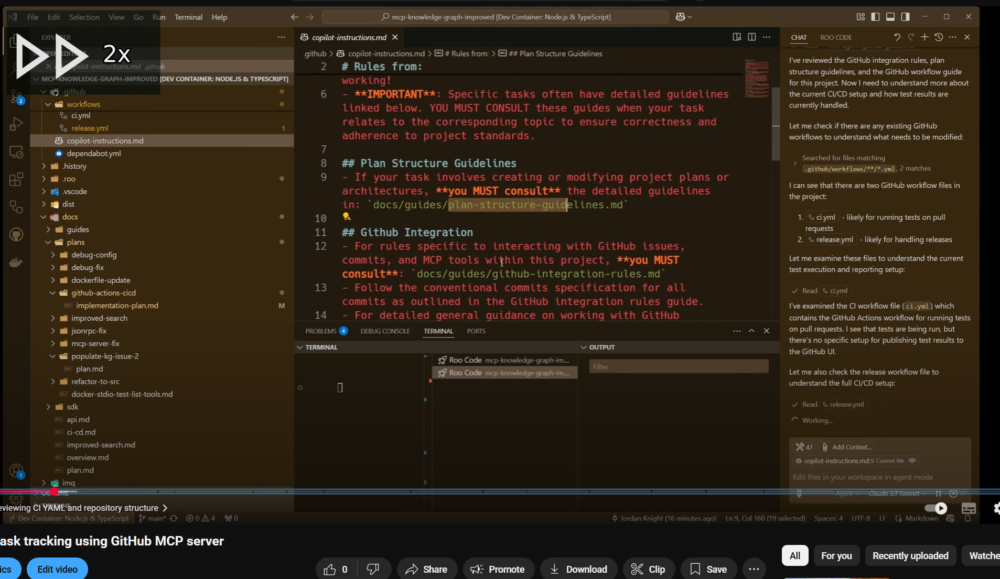

# 🚀 VideoSpeeder: Turbocharge Your Video Editing! 🎬💨

[](https://opensource.org/licenses/MIT)

Tired of manually cutting out silent pauses in your videos? **VideoSpeeder** is here to revolutionize your workflow! ⚡️

This tool intelligently analyzes your video, detects silent segments, and automatically speeds them up, saving you precious editing time. Perfect for:

*   🎙️ **Podcasters & YouTubers:** Condense long recordings quickly.
*   👨‍🏫 **Educators & Presenters:** Make lectures more engaging.
*   💻 **Coders & Tutorial Makers:** Skip the thinking pauses in screen recordings.
*   ...anyone who wants faster, tighter videos!
[](https://www.youtube.com/watch?v=XHBKlCnk-7k)

🎥 [Have a look at a video that uses it here](https://www.youtube.com/watch?v=XHBKlCnk-7k).

## ✨ Key Features

*   🗣️ **Speech Detection (VAD):** Uses **Silero VAD** (on by default) to detect actual human speech — ignores wind, keyboard, mouse, and ambient noise.
*   🤫 **Fallback Silence Detection:** `--no-vad` mode uses `ffmpeg`'s `silencedetect` filter for amplitude-based detection (useful for clean audio).
*   ⏩ **Dynamic Speed-Up:** Automatically calculates the optimal speed for silent parts, aiming for a concise ~4-second duration while capping at a blazing 1000x! Shorter silences get a fixed 4x boost.
*   📊 **Rich CLI Stats:** Get beautifully formatted video stats upfront using `rich`.
*   👁️ **Visual Speed Indicator:** Optional `>> [Speed]x` overlay shows exactly when the video is sped up.
*   💡 **Transcription Power:** Includes a separate script (`transcribe.py`) leveraging **OpenAI Whisper** for highly accurate VTT subtitle generation. Choose your model size!
*   ⚙️ **Fine-Tuned Control:** Adjust silence detection `threshold` (dB) and minimum `duration` (seconds).
*   ⏱️ **Segment Processing:** Process only specific parts of your video using `--offset` and `--process-duration`.
*   🚀 **GPU Acceleration:** Supports NVIDIA NVENC for encoding and CUVID/NVDEC for decoding (requires compatible hardware, drivers, and FFmpeg build) for significantly faster processing.
*   ⏳ **Progress Bar:** Keep track of the process with a `tqdm` progress bar.

## Quick Start (using Just)

[Just](https://github.com/casey/just) is a command runner. Install it, then:

```bash
# 1. Set up the Python venv (installs torch, silero-vad, etc.)
just venv

# 2. Speed up a single video (VAD + GPU on by default)
just speed input=my_video.mp4 out_vad=my_video_fast.mp4

# 3. Multi-angle: detect on one file, speed up all files in a folder
just speed-all folder=recordings/ master=recordings/facecam.mp4 folder_output=recordings/output/

# 4. Browse output files in your browser (requires Docker)
just browse browse_dir=recordings/output/
```

Run `just` with no args to see all available recipes.

## ✅ Requirements

*   **Python 3.x**
*   **FFmpeg & FFprobe:** Must be installed and accessible in your system's PATH.
*   **Python Packages:** Listed in `videospeeder_project/requirements.txt`. Install them via pip.
    ```bash
    pip install -r videospeeder_project/requirements.txt
    ```
    *(Note: `--vad` requires installing PyTorch + Silero VAD; this can add significant install size.)*
*   **(Optional) NVIDIA GPU & Drivers:** For GPU acceleration features.
*   **(Optional) CUDA Toolkit:** Often needed for Whisper's GPU support during transcription.

## 🛠️ Installation

1.  **Clone the repository:**
    ```bash
    git clone https://github.com/jakkaj/videospeeder.git
    cd videospeeder
    ```
2.  **Install Python dependencies:**
    ```bash
    # Navigate into the project directory if you aren't already
    cd videospeeder_project
    pip install -r requirements.txt
    # Or use the Makefile shortcut from the project root
    # make install # (Run this from within videospeeder_project/)
    ```
    *(Note: The `make install` command in the Makefile assumes you are inside the `videospeeder_project` directory).*

## 🏃‍♀️ Usage

VideoSpeeder consists of two main scripts located in the `videospeeder_project` directory.

### 1. Speeding Up Videos (`videospeeder.py`)

Run this script from within the `videospeeder_project` directory.

```bash
python videospeeder.py --input <your_video.mp4> --output <output_video.mp4> [OPTIONS]
```

**Common Options:**

*   `-i, --input`: Path to your input video file (Required).
*   `-o, --output`: Path for the processed output video file (Required).
*   `-t, --threshold`: Silence threshold in dB (Default: -30.0). Lower values detect quieter sounds as silence.
*   `-d, --duration`: Minimum duration of silence in seconds to be sped up (Default: 2.0).
*   `--no-vad`: Disable VAD and fall back to FFmpeg silencedetect (amplitude-based).
*   `--vad-threshold`: Speech probability threshold in `[0.0, 1.0]` (Default: `0.75`). Higher rejects more noise.
*   `--indicator`: Show the `>> [Speed]x` overlay during sped-up parts.
*   `--gpu`: Enable NVIDIA NVENC GPU *encoding*.
*   `--gpu-decode`: Enable NVIDIA CUVID/NVDEC GPU *decoding* (Experimental).
*   `--offset`: Start processing from this time (in seconds).
*   `--process-duration`: Process only this duration (in seconds) from the start (or offset).
*   `--detect`: Detect speech/silence and write a `.vad.json` sidecar file next to the input video, then exit. No output video is produced.
*   `--vad-json`: Load silence intervals from a previously generated `.vad.json` sidecar instead of running live detection.
*   `--quiet`: Suppress informational output (progress bars and summary still shown).
*   `--folder`: Process all video files in a directory using a shared `.vad.json` sidecar.
*   `--vad-master`: Master video file for VAD detection in folder mode. Detects speech on this file, writes a sidecar, then processes all videos in `--folder`.
*   `--overwrite`: Re-process videos even if output files already exist (default: skip existing).
*   `--extensions`: Comma-separated video file extensions for folder mode (Default: `mp4,mkv,mov,avi,webm`).
*   `--parallel N`: Process N videos simultaneously in folder mode (Default: 1). Best with `--gpu`; each video uses one NVENC session.

**Example:**

```bash
# Process a video (VAD speech detection is on by default)
python videospeeder.py -i my_recording.mp4 -o my_recording_fast.mp4

# With GPU encoding and speed indicator overlay
python videospeeder.py -i my_recording.mp4 -o my_recording_fast.mp4 --gpu --indicator

# Tune VAD sensitivity for very noisy audio
python videospeeder.py -i my_recording.mp4 -o my_recording_fast.mp4 --vad-threshold 0.80

# Fall back to amplitude-based detection (no VAD)
python videospeeder.py -i my_recording.mp4 -o my_recording_fast.mp4 --no-vad -t -40
```

### Multi-Angle Workflow

If you record with multiple camera angles (e.g. facecam, screen capture, overhead), VideoSpeeder can process them all with identical timing from a single speech-detection pass.

**Two-step workflow (detect once, then process all):**

```bash
# Step 1: Detect speech on the master audio source (writes facecam.vad.json)
python videospeeder.py -i recordings/facecam.mp4 --detect

# Step 2: Process all videos in the folder using the shared sidecar
python videospeeder.py --folder recordings/ -o recordings/output/ --gpu
```

**One-liner workflow (detect + process in a single command):**

```bash
python videospeeder.py --folder recordings/ --vad-master facecam.mp4 -o recordings/output/ --gpu
```

**Parallel processing (process 2 videos at once for ~1.8x faster throughput):**

```bash
python videospeeder.py --folder recordings/ -o recordings/output/ --gpu --parallel 2
```

Both workflows produce output files with identical segment timing, so they stay in perfect sync when imported into your NLE.

**Folder mode features:**
- Auto-discovers the `.vad.json` sidecar in the folder (errors if zero or multiple found)
- Skips already-processed outputs by default; use `--overwrite` to re-process
- Continues processing if a single file fails, with a summary at the end
- Handles duration mismatches between angles (truncates silence intervals per video)
- `--parallel N` processes N videos simultaneously; `--parallel 2` is the sweet spot for GPU encoding. Consumer GPUs support 8-12 concurrent NVENC sessions

**Offline note for `--vad`:**
- Silero VAD may download/cache model assets on first use. If you're offline, run once while online or preload
  the model in your environment before using `--vad` without network.

### 2. Transcribing Videos/Audio (`transcribe.py`)

Run this script from within the `videospeeder_project` directory.

```bash
python transcribe.py --input <your_video_or_audio.mp4> --output <subtitles.vtt> [OPTIONS]
```

**Common Options:**

*   `-i, --input`: Path to your input video or audio file (Required).
*   `-o, --output`: Path for the output VTT subtitle file (Required).
*   `-m, --model`: Whisper model size (Choices: `tiny`, `base`, `small`, `medium`, `large`. Default: `large`). Larger models are more accurate but require more resources.

**Example:**

```bash
# Transcribe a video using the 'medium' Whisper model
python transcribe.py -i my_recording_fast.mp4 -o my_recording_subs.vtt -m medium
```

### Using the Makefile (Convenience)

The `Makefile` inside `videospeeder_project` provides shortcuts for common tasks (run from within `videospeeder_project` directory):

*   `make install`: Install dependencies.
*   `make test`: Run a test using a sample file path (edit the path in the Makefile first!) with GPU and indicator.
*   `make test-segment`: Run a test on a segment.
*   `make transcribe INPUT=video.mp4 OUTPUT=subs.vtt [MODEL=large]`: Transcribe a file.
*   `make transcript-segment`: Transcribe the output of `make test-segment`.
*   `make clean`: Remove generated `.mp4` files from the directory.
*   `make help`: Show available make commands.

## 📄 License

This project is licensed under the **MIT License**. See the [LICENSE](LICENSE) file for details.

## 🙌 Contributing

Found a bug or have an idea? Feel free to open an issue on the GitHub repository!
