# VAD Speech Detection (Silero) Implementation Plan

**Mode**: Simple  
**Plan Version**: 1.0.0  
**Created**: 2025-12-18  
**Spec Path (absolute)**: `/Users/jordanknight/github/videospeeder/docs/plans/006-vad/vad-speech-detection-spec.md`  
**Plan Path (absolute)**: `/Users/jordanknight/github/videospeeder/docs/plans/006-vad/vad-speech-detection-plan.md`  
**Status**: READY

## Table of Contents

1. [Executive Summary](#executive-summary)
2. [Critical Research Findings](#critical-research-findings)
3. [Implementation](#implementation)
4. [Change Footnotes Ledger](#change-footnotes-ledger)
5. [Appendix A: Detailed Discoveries (with examples)](#appendix-a-detailed-discoveries-with-examples)
6. [Appendix B: Deduplication Log](#appendix-b-deduplication-log)

## Executive Summary

VideoSpeeder currently treats “silence” as low-amplitude audio via FFmpeg `silencedetect`, which fails on
screencasts because keyboard and UI noise often prevents speed-up even when there is no human speech.

Add an optional `--vad` mode that detects human speech via Silero VAD and converts detected speech into
non-speech intervals, reusing the existing segment/filtergraph pipeline so only detection changes.

**Solution approach**
- Add `--vad` and `--vad-threshold` (default `0.75`) to toggle detection backend and tune sensitivity.
- When `--vad` is active, extract `16000 Hz` mono PCM via FFmpeg pipe and run Silero
  `get_speech_timestamps(..., return_seconds=True)`.
- Post-process speech timestamps (merge, pad) and compute the complement to produce `silence_intervals`
  compatible with `calculate_segments()` and `build_filtergraph()`.
- Keep current `silencedetect` path unchanged when `--vad` is not provided.

**Success metrics (observable)**
- With `--vad`, keyboard-only sections are generally classified as non-speech and get sped up.
- Speech segments are preserved at normal speed.
- Without `--vad`, outputs match current behavior for the same inputs and flags.

## Critical Research Findings

Concise, action-focused findings (full detail in Appendix A).

| # | Impact | Finding | Action |
|---|--------|---------|--------|
| 01 | Critical | Offset + duration must stay aligned across detection and processing | Apply `--offset/--process-duration` consistently to both VAD audio extraction and FFmpeg processing |
| 02 | Critical | Chunk boundaries can create false “silence” | Add chunk stitching strategy: merge/pad speech segments and handle boundary overlap |
| 03 | Critical | Tool assumes an audio stream exists (`[0:a]`) | Fail clearly when input lacks audio; do not silently produce corrupt filtergraphs |
| 04 | Critical | `silencedetect` must remain default and unchanged | Branch in `main()`; keep current functions and defaults intact |
| 05 | High | VAD output needs normalization/merging to avoid jitter | Merge adjacent/overlapping segments; clamp to `[0, video_duration]` |
| 06 | High | Dependency UX must be explicit (PyTorch stack) | Lazy-import VAD deps and emit actionable install guidance when missing |
| 07 | High | FFmpeg pipe usage can deadlock if stderr not drained | Use `subprocess.Popen` patterns that avoid blocking; keep `-loglevel error` |
| 08 | High | Avoid adding new heavy deps beyond the spec | Prefer standard library + torch over adding `numpy` or `scipy` |
| 09 | High | VAD parameters must be tuned for screencasts | Default `--vad-threshold 0.75`; expose flag for tuning |
| 10 | High | Speech padding prevents clipped word boundaries | Apply a small pad to speech segments before complementing to silence |
| 11 | Medium | Very short non-speech gaps may cause over-fragmentation | Filter or merge gaps to avoid micro-segments that bloat filtergraphs |
| 12 | Medium | VAD can produce “no speech” or “all speech” edge outputs | Handle empty/full speech lists to produce valid silence intervals |
| 13 | Medium | Model load may require network the first time | Document offline constraints in README and fail with clear messaging |
| 14 | Medium | Torch threading can cause oversubscription | Set torch thread count conservatively for deterministic CPU behavior |
| 15 | Medium | Audio extraction must pick a deterministic audio stream | Use a consistent mapping strategy (default first audio stream) |
| 16 | Medium | Existing script prints verbose debug output | Add a single clear “detector active” status line without changing other logs |
| 17 | Medium | Segment invariants are strict (no gaps/overlaps) | Validate interval ordering and coverage before building filtergraph |
| 18 | Low | Windows shells can be picky about quoting | Keep FFmpeg invocation list-based (no shell=True) |
| 19 | Low | Indicator overlay should remain compatible | Ensure only segment classification changes; overlay logic stays intact |
| 20 | Low | Keep future ONNX path open | Isolate VAD calls behind a small function boundary |

## Implementation

### Workflow Gates & Validation

**GATE – Clarify**
- Spec has `**Mode**: Simple` and no `[NEEDS CLARIFICATION]` markers.
- Spec includes `## Testing Strategy` (Manual Only) and `## Documentation Strategy` (README.md only).

**GATE – Constitution**
- Constitution file exists at `/Users/jordanknight/github/videospeeder/docs/rules-idioms-architecture/constitution.md`.
- This plan uses CS scoring (no work effort/time estimates).

**Deviation Ledger**

| Principle Violated | Why Needed | Simpler Alternative Rejected | Risk Mitigation |
|-------------------|------------|------------------------------|-----------------|
| – | – | – | – |

**GATE – Architecture**
- Architecture file exists at `/Users/jordanknight/github/videospeeder/docs/rules-idioms-architecture/architecture.md`.
- Plan preserves architecture boundaries by keeping VAD as an alternate “Silence Detection Executor” that
  produces `silence_intervals` for the existing segment/filtergraph pipeline.

**GATE – Rules & Idioms (Repo Layout Note)**
- The planning template references `docs/project-rules/{rules.md, idioms.md, architecture.md}`.
- This repo stores equivalent documents under:
  - `/Users/jordanknight/github/videospeeder/docs/rules-idioms-architecture/rules.md`
  - `/Users/jordanknight/github/videospeeder/docs/rules-idioms-architecture/idioms.md`
  - `/Users/jordanknight/github/videospeeder/docs/rules-idioms-architecture/architecture.md`

**GATE – ADR (Optional)**
- No ADR directory found at `/Users/jordanknight/github/videospeeder/docs/adr/`.

### Project Type and Directory Structure

**Project type**: CLI

**Relevant directory tree (repo-root absolute)**
```
/Users/jordanknight/github/videospeeder/
├── /Users/jordanknight/github/videospeeder/README.md
├── /Users/jordanknight/github/videospeeder/docs/plans/006-vad/
│   ├── /Users/jordanknight/github/videospeeder/docs/plans/006-vad/deep-research-findings/
│   ├── /Users/jordanknight/github/videospeeder/docs/plans/006-vad/vad-speech-detection-spec.md
│   └── /Users/jordanknight/github/videospeeder/docs/plans/006-vad/vad-speech-detection-plan.md
├── /Users/jordanknight/github/videospeeder/docs/rules-idioms-architecture/
│   ├── /Users/jordanknight/github/videospeeder/docs/rules-idioms-architecture/architecture.md
│   ├── /Users/jordanknight/github/videospeeder/docs/rules-idioms-architecture/constitution.md
│   ├── /Users/jordanknight/github/videospeeder/docs/rules-idioms-architecture/idioms.md
│   └── /Users/jordanknight/github/videospeeder/docs/rules-idioms-architecture/rules.md
└── /Users/jordanknight/github/videospeeder/videospeeder_project/
    ├── /Users/jordanknight/github/videospeeder/videospeeder_project/requirements.txt
    └── /Users/jordanknight/github/videospeeder/videospeeder_project/videospeeder.py
```

### Testing Philosophy

**Testing approach**: Manual Only (per spec)  
**Mock usage**: N/A (no automated tests)

Manual validation focuses on:
- `--vad` activates VAD detection and changes which segments are sped up
- Speech is preserved (no “sped-up speech”)
- Keyboard/UI noise during pauses is treated as non-speech and sped up
- Dependency-missing and offline scenarios are handled with actionable errors
- Default path (no `--vad`) remains unchanged

### Single Phase: VAD Integration

**Objective**: Add `--vad` detection backend that classifies speech vs non-speech and feeds the existing
segment/filtergraph pipeline with compatible silence intervals.

**Deliverables**
- `--vad` and `--vad-threshold` CLI flags implemented
- Silero VAD dependency integration with clear dependency errors
- FFmpeg audio extraction to `16000 Hz` mono PCM via pipe for VAD
- Speech-to-silence interval conversion producing valid `silence_intervals`
- README updated to document new flags and tradeoffs

**Risks**

| Risk | Likelihood | Impact | Mitigation |
|------|------------|--------|------------|
| PyTorch install failures on some systems | Med | High | Lazy import with clear install message; keep `silencedetect` default path unchanged |
| First-run model retrieval fails without network | Med | Med | README docs + error message describing offline prep; ensure failure is explicit |
| False positives on loud typing | Med | Med | Default threshold tuned for keyboard; expose `--vad-threshold` |
| Segment fragmentation increases filtergraph size | Med | Med | Post-process speech segments: merge/pad and filter micro gaps |
| Chunk boundary artifacts | Low | High | Stitch speech segments across chunks; apply overlap strategy and merging tolerance |

### Tasks (Manual Only)

| Status | ID | Task | CS | Type | Dependencies | Absolute Path(s) | Validation | Notes |
|--------|-----|------|----|------|--------------|------------------|------------|-------|
| [x] | T001 | Add CLI flags `--vad` and `--vad-threshold` | CS-2 | Core | – | `/Users/jordanknight/github/videospeeder/videospeeder_project/videospeeder.py` | `--help` shows new flags; default threshold is `0.75` | Keep existing `--threshold/--duration` semantics for `silencedetect` |
| [x] | T002 | Add VAD deps to requirements | CS-2 | Setup | – | `/Users/jordanknight/github/videospeeder/videospeeder_project/requirements.txt` | Dependency install succeeds in a clean venv | Add `torch`, `torchaudio`, `silero-vad` only (ONNX deferred) |
| [x] | T003 | Implement VAD dependency probe + actionable error | CS-2 | Core | T001 | `/Users/jordanknight/github/videospeeder/videospeeder_project/videospeeder.py` | Running with `--vad` and missing deps exits non-zero with install guidance | Lazy import `silero_vad` and `torch` only when `--vad` is used |
| [x] | T004 | Implement FFmpeg audio extraction to PCM via pipe | CS-3 | Core | T001 | `/Users/jordanknight/github/videospeeder/videospeeder_project/videospeeder.py` | Extracted bytes are non-empty for typical inputs; errors for missing audio stream | Apply `--offset` and `--process-duration` consistently (Finding 01) |
| [x] | T005 | Convert PCM bytes to normalized torch tensor | CS-2 | Core | T004, T002 | `/Users/jordanknight/github/videospeeder/videospeeder_project/videospeeder.py` | Tensor is 1-D float with expected range; length matches extracted PCM | Prefer stdlib conversion (avoid introducing `numpy`) |
| [x] | T006 | Add streaming PCM reader for large inputs | CS-3 | Core | T004, T005 | `/Users/jordanknight/github/videospeeder/videospeeder_project/videospeeder.py` | Does not require full-audio buffering; emits sequential chunks | Use `chunk_samples` constant; keep timestamps continuous |
| [x] | T007 | Detect speech segments with Silero (`return_seconds=True`) | CS-3 | Core | T006, T003 | `/Users/jordanknight/github/videospeeder/videospeeder_project/videospeeder.py` | Returns ordered `[(start,end), ...]` speech segments relative to processed region | Set `sampling_rate=16000`; thread count conservative |
| [x] | T008 | Post-process speech segments (merge/pad/clamp) | CS-3 | Core | T007 | `/Users/jordanknight/github/videospeeder/videospeeder_project/videospeeder.py` | Output is sorted, non-overlapping, and clamped within `[0, video_duration]` | Merge adjacency to reduce fragmentation (Finding 05, 10, 11) |
| [x] | T009 | Convert speech segments → silence intervals | CS-2 | Core | T008 | `/Users/jordanknight/github/videospeeder/videospeeder_project/videospeeder.py` | Silence intervals cover non-speech portions without overlap; handles no-speech/all-speech | Must preserve `calculate_segments()` invariants (Finding 17) |
| [x] | T010 | Integrate VAD branch into `main()` | CS-3 | Core | T009 | `/Users/jordanknight/github/videospeeder/videospeeder_project/videospeeder.py` | With `--vad`, code does not call `run_silencedetect()`; without `--vad`, behavior unchanged | Print a single status line indicating detector and threshold |
| [x] | T011 | Add interval sanity-check before filtergraph build | CS-2 | Safety | T010 | `/Users/jordanknight/github/videospeeder/videospeeder_project/videospeeder.py` | Invalid intervals cause clear failure before FFmpeg invocation | Guard against negative, unsorted, or out-of-range intervals |
| [x] | T012 | Update README for `--vad` and tuning | CS-2 | Docs | T001, T002 | `/Users/jordanknight/github/videospeeder/README.md` | README documents new flags, tuning, deps, and offline notes | Docs strategy is README-only (per spec) |
| [x] | T013 | Manual validation: baseline vs VAD on screencast | CS-2 | Test | T010 | N/A (manual run) | Run commands in “Manual Validation Commands”; outputs created; checklist passes | Requires a representative input asset (see “Manual Validation Commands”) |
| [x] | T014 | Manual validation: dependency-missing path | CS-1 | Test | T003 | N/A (manual run) | Run commands in “Manual Validation Commands”; exits non-zero with required message | Simulate missing deps via clean venv or uninstall |
| [x] | T015 | Manual validation: `--indicator` with `--vad` | CS-1 | Test | T010 | N/A (manual run) | Run commands in “Manual Validation Commands”; overlay visible during sped-up segments | Confirms overlay pipeline is unaffected |

### Architecture Map (Single Phase)

```mermaid
flowchart TD
  classDef pending fill:#eee,stroke:#999,color:#111
  classDef inprogress fill:#ffd,stroke:#cc0,color:#111
  classDef completed fill:#dfd,stroke:#090,color:#111
  classDef blocked fill:#fdd,stroke:#c00,color:#111

  subgraph Tasks
    T001["T001: CLI flags ✓"]:::completed
    T002["T002: requirements.txt deps ✓"]:::completed
    T003["T003: deps probe + UX ✓"]:::completed
    T004["T004: ffmpeg PCM pipe ✓"]:::completed
    T005["T005: PCM -> torch tensor ✓"]:::completed
    T006["T006: streaming PCM reader ✓"]:::completed
    T007["T007: Silero speech detection ✓"]:::completed
    T008["T008: post-process speech segs ✓"]:::completed
    T009["T009: speech -> silence intervals ✓"]:::completed
    T010["T010: main() VAD branch ✓"]:::completed
    T011["T011: interval sanity checks ✓"]:::completed
    T012["T012: README docs ✓"]:::completed
    T013["T013: manual validate baseline vs VAD ✓"]:::completed
    T014["T014: manual validate missing deps ✓"]:::completed
    T015["T015: manual validate indicator ✓"]:::completed
  end

  subgraph Files
    F_VP["videospeeder.py ✓"]:::completed
    F_REQ["requirements.txt ✓"]:::completed
    F_README["README.md ✓"]:::completed
    F_LOG["execution.log.md ✓"]:::completed
  end

  T001 --> F_VP
  T002 --> F_REQ
  T003 --> F_VP
  T004 --> F_VP
  T005 --> F_VP
  T006 --> F_VP
  T007 --> F_VP
  T008 --> F_VP
  T009 --> F_VP
  T010 --> F_VP
  T011 --> F_VP
  T012 --> F_README
  T013 --> F_LOG
  T014 --> F_LOG
  T015 --> F_LOG
```



### Task-to-Component Mapping

| Task | Component | Status |
|------|-----------|--------|
| T001 | CLI Argument Parser | ✅ |
| T002 | Packaging / Dependencies | ✅ |
| T003 | Error Handling / UX | ✅ |
| T004 | VAD Audio Extraction | ✅ |
| T005 | VAD Audio Decode | ✅ |
| T006 | VAD Streaming | ✅ |
| T007 | VAD Inference | ✅ |
| T008 | VAD Post-Processing | ✅ |
| T009 | Interval Conversion | ✅ |
| T010 | Pipeline Integration | ✅ |
| T011 | Interval Validation | ✅ |
| T012 | Documentation | ✅ |
| T013 | Manual Validation | ✅ |
| T014 | Manual Validation | ✅ |
| T015 | Manual Validation | ✅ |

### Acceptance Criteria

- [ ] Running without `--vad` uses existing `silencedetect` behavior unchanged.
- [ ] Running with `--vad` classifies speech vs non-speech and speeds up non-speech segments.
- [ ] `--vad-threshold` is configurable and defaults to `0.75`.
- [ ] Missing VAD deps cause a clear, actionable error (install guidance) without affecting non-VAD runs.
- [ ] Offset/duration options remain consistent: detection and processing apply the same region semantics.
- [ ] The output video quality settings and overlay behavior are unchanged; only segment timing differs.
- [ ] VAD edge cases are handled: no speech, all speech, and short inputs produce valid segment lists.

### Manual Validation Commands (maps to T013–T015)

**Test asset requirements**
- Provide an input video with: (1) spoken narration, (2) keyboard-only stretches, (3) brief pauses.
- Suggested location: `/Users/jordanknight/github/videospeeder/scratch/`
- Example placeholder used below: `/Users/jordanknight/github/videospeeder/scratch/input.mp4`

**Baseline (silencedetect default)**
```bash
python /Users/jordanknight/github/videospeeder/videospeeder_project/videospeeder.py \
  -i /Users/jordanknight/github/videospeeder/scratch/input.mp4 \
  -o /Users/jordanknight/github/videospeeder/scratch/out-silencedetect.mp4
```
Pass/Fail checklist:
- Pass: output file exists at `/Users/jordanknight/github/videospeeder/scratch/out-silencedetect.mp4`.
- Pass: console output includes `Running FFmpeg silencedetect...`.
- Pass: output playback is valid (video + audio present).

**VAD**
```bash
python /Users/jordanknight/github/videospeeder/videospeeder_project/videospeeder.py \
  -i /Users/jordanknight/github/videospeeder/scratch/input.mp4 \
  -o /Users/jordanknight/github/videospeeder/scratch/out-vad.mp4 \
  --vad
```
Pass/Fail checklist:
- Pass: output file exists at `/Users/jordanknight/github/videospeeder/scratch/out-vad.mp4`.
- Pass: console output includes a single VAD “detector active” status line (defined by T010).
- Pass: console output does NOT include `Running FFmpeg silencedetect...`.
- Pass: output playback is valid (video + audio present).
- Pass (behavioral): typing-only stretches are sped up compared to baseline; spoken narration is not sped up.

**VAD threshold tuning (optional, for diagnosing false positives/negatives)**
```bash
python /Users/jordanknight/github/videospeeder/videospeeder_project/videospeeder.py \
  -i /Users/jordanknight/github/videospeeder/scratch/input.mp4 \
  -o /Users/jordanknight/github/videospeeder/scratch/out-vad-thresh-080.mp4 \
  --vad --vad-threshold 0.80
```
Pass/Fail checklist:
- Pass: output file exists at `/Users/jordanknight/github/videospeeder/scratch/out-vad-thresh-080.mp4`.
- Pass: console output shows threshold `0.80` in the VAD status line.

**Dependency-missing validation (simulate missing deps)**
Run in a clean Python environment without `torch/torchaudio/silero-vad`, then:
```bash
python /Users/jordanknight/github/videospeeder/videospeeder_project/videospeeder.py \
  -i /Users/jordanknight/github/videospeeder/scratch/input.mp4 \
  -o /Users/jordanknight/github/videospeeder/scratch/out-vad-missing-deps.mp4 \
  --vad
```
Pass/Fail checklist:
- Pass: command exits non-zero.
- Pass: stderr/stdout includes install guidance mentioning `torch`, `torchaudio`, and `silero-vad`.
- Pass: it does not attempt to run the `silencedetect` path as a fallback.

**Indicator overlay with VAD**
```bash
python /Users/jordanknight/github/videospeeder/videospeeder_project/videospeeder.py \
  -i /Users/jordanknight/github/videospeeder/scratch/input.mp4 \
  -o /Users/jordanknight/github/videospeeder/scratch/out-vad-indicator.mp4 \
  --vad --indicator
```
Pass/Fail checklist:
- Pass: output file exists at `/Users/jordanknight/github/videospeeder/scratch/out-vad-indicator.mp4`.
- Pass: overlay appears during sped-up segments (where VAD classified non-speech).

### Discoveries & Learnings

| Date | Task | Type | Discovery | Resolution | References |
|------|------|------|-----------|------------|------------|
| 2025-12-18 | – | decision | Manual testing approach per spec; automation via plan-6a not available in this environment | Track progress directly in this plan + execution log | `/Users/jordanknight/github/videospeeder/docs/plans/006-vad/execution.log.md` |
| 2025-12-18 | T010 | gotcha | `fastforward.png` was referenced as a cwd-relative path and broke processing when run from repo root | Resolve PNG path relative to `videospeeder_project/videospeeder.py` (`__file__`) | `/Users/jordanknight/github/videospeeder/docs/plans/006-vad/execution.log.md` |
| 2025-12-18 | T010 | workaround | Local environment lacked `tqdm`, blocking processing | Added a no-progress-bar fallback so FFmpeg can still run | `/Users/jordanknight/github/videospeeder/docs/plans/006-vad/execution.log.md` |
| 2025-12-18 | T013 | gotcha | Installing `silero-vad` pulled in `onnxruntime` and `numpy` as transitive dependencies | Accept packaging reality; keep PyTorch path in code (no explicit ONNX backend selection) | `/Users/jordanknight/github/videospeeder/docs/plans/006-vad/execution.log.md` |
| 2025-12-18 | T013 | gotcha | System Python is PEP 668 externally-managed and blocks `pip install` without extra flags | Use a local virtualenv (`/Users/jordanknight/github/videospeeder/.venv-vad/`) for manual validation | `/Users/jordanknight/github/videospeeder/docs/plans/006-vad/execution.log.md` |

### Complexity Tracking (CS rubric from constitution)

| Component | CS | Label | Breakdown (S,I,D,N,F,T) | Justification | Mitigation |
|-----------|----|-------|--------------------------|---------------|------------|
| VAD detection backend | CS-3 | medium | S=1, I=1, D=0, N=1, F=1, T=1 | New external ML deps + audio extraction + interval conversion | Keep default path unchanged; fail clearly on missing deps |
| Streaming PCM + stitching | CS-3 | medium | S=1, I=0, D=0, N=1, F=1, T=0 | Boundary handling + segment merge correctness | Centralize merge/clamp logic; sanity-check intervals |

### Progress Tracking

- [x] Single Phase: VAD Integration – COMPLETE

**STOP Rule**

This plan is complete. Next step is `/plan-4-complete-the-plan` before creating phase task dossiers.

## Change Footnotes Ledger

[^1]: [To be added during implementation via plan-6a]
[^2]: [To be added during implementation via plan-6a]
[^3]: [To be added during implementation via plan-6a]

---

## Appendix A: Detailed Discoveries (with examples)

The discoveries below are synthesized from four research lenses:
- **S1** (Codebase patterns):
  - `/Users/jordanknight/github/videospeeder/videospeeder_project/videospeeder.py`
  - `/Users/jordanknight/github/videospeeder/docs/rules-idioms-architecture/idioms.md`
- **S2** (Technical constraints): FFmpeg pipe semantics, Silero VAD API requirements
- **S3** (Spec implications + edge cases):
  - `/Users/jordanknight/github/videospeeder/docs/plans/006-vad/vad-speech-detection-spec.md`
- **S4** (Dependencies + boundaries):
  - `/Users/jordanknight/github/videospeeder/docs/rules-idioms-architecture/architecture.md`
  - `/Users/jordanknight/github/videospeeder/docs/rules-idioms-architecture/rules.md`

### 🚨 Critical Discovery 01: Offset + duration must stay aligned across detection and processing
**Impact**: Critical  
**Sources**: [S1-01, S3-01, S4-01]  
**Problem**: The current pipeline builds segments relative to the processed region; mismatched offset handling
produces incorrect trimming and can misclassify segments.  
**Root Cause**: `run_silencedetect()` applies `-ss/-t` and the rest of the pipeline assumes resulting
intervals are relative to a region starting at `0`. VAD must produce intervals in the same coordinate
system.  
**Solution**: Apply `-ss/-t` to VAD audio extraction too; compute silence intervals in `[0, video_duration]`.
**Example**:
```python
# ❌ WRONG - VAD timestamps are full-file absolute, but filtergraph uses 0-based region
speech = detect_speech_full_file(input_path)  # timestamps relative to full media
silence = speech_to_silence(speech, total_duration=processed_duration)  # mismatched coordinate system

# ✅ CORRECT - apply the same region parameters to audio extraction used by processing
audio = extract_audio_pcm(input_path, offset=args.offset, process_duration=args.process_duration)
speech = detect_speech_region(audio)  # timestamps relative to processed region
silence = speech_to_silence(speech, total_duration=video_duration)
```
**Action Required**: Implement VAD extraction that respects `--offset/--process-duration`.  
**Affects Phases**: Single Phase (T004, T010)

### 🚨 Critical Discovery 02: Chunk boundaries can create false non-speech
**Impact**: Critical  
**Sources**: [S2-02, S3-02]  
**Problem**: Per-chunk VAD runs can split speech at chunk boundaries, creating artificial gaps that become
“silence” and get sped up.  
**Root Cause**: VAD decisions depend on local context; naive chunk concatenation without overlap/merge
creates boundary artifacts.  
**Solution**: Use overlap between chunks and post-merge segments with tolerance; apply padding after merge.
**Example**:
```python
# ❌ WRONG - independent chunks, no overlap; boundary splits become fake silence
for chunk in chunks:
    speech.extend(get_speech_timestamps(chunk, model, return_seconds=True))

# ✅ CORRECT - overlap and merge, then pad once
for chunk, chunk_offset in overlapped_chunks:
    segs = get_speech_timestamps(chunk, model, return_seconds=True)
    speech.extend([(s["start"] + chunk_offset, s["end"] + chunk_offset) for s in segs])
speech = merge_adjacent_and_overlapping(speech, tolerance=MERGE_TOLERANCE)
speech = pad_and_clamp(speech, pad=PAD, max_end=video_duration)
```
**Action Required**: Implement chunk stitching strategy and a single post-processing pass.  
**Affects Phases**: Single Phase (T006, T008)

### 🚨 Critical Discovery 03: Input without audio must fail clearly
**Impact**: Critical  
**Sources**: [S1-03, S2-03, S3-03]  
**Problem**: `build_filtergraph()` assumes an audio stream (`[0:a]`). If the input lacks audio, FFmpeg will
fail later with confusing errors.  
**Root Cause**: Current code does not pre-check “has audio stream” before building a graph that uses audio.
VAD extraction via FFmpeg will also return empty output or an error.  
**Solution**: When `--vad` is enabled, treat “no audio stream” as a hard error early with actionable output.
**Example**:
```python
# ❌ WRONG - proceed with empty audio and later fail deep inside FFmpeg
audio_bytes = extract_audio_pcm(...)
speech = detect_speech(audio_bytes)  # empty

# ✅ CORRECT - detect missing/empty audio and fail early
audio_bytes = extract_audio_pcm(...)
if not audio_bytes:
    raise RuntimeError("No audio stream found; cannot run VAD mode.")
```
**Action Required**: Validate extracted audio is non-empty; fail before filtergraph build.  
**Affects Phases**: Single Phase (T004, T011)

### 🚨 Critical Discovery 04: Default silencedetect path must remain unchanged
**Impact**: Critical  
**Sources**: [S1-04, S3-04, S4-04]  
**Problem**: VAD is optional; regression risk is high if the default path is modified.  
**Root Cause**: `main()` currently always runs `run_silencedetect()`; adding VAD must be an explicit branch.
**Solution**: Only activate VAD when `--vad` is passed; otherwise run existing code path unchanged.
**Example**:
```python
# ✅ CORRECT - explicit backend switch
if args.vad:
    silence_intervals = compute_silence_intervals_vad(...)
else:
    silencedetect_stderr = run_silencedetect(...)
    silence_intervals = parse_silencedetect_output(silencedetect_stderr)
```
**Action Required**: Implement a backend switch with no refactors that alter default behavior.  
**Affects Phases**: Single Phase (T010)

### High Discovery 05: Silence interval invariants must be enforced before filtergraph build
**Impact**: High  
**Sources**: [S1-05, S4-02]  
**Problem**: Unsorted or overlapping intervals can generate invalid segments and broken filtergraphs.  
**Root Cause**: Existing `calculate_segments()` assumes its input is reasonable and does not validate it.
**Solution**: Add an interval validation/sanitization step for VAD-derived intervals.
**Example**:
```python
# ✅ CORRECT - normalize before calculate_segments()
silence_intervals = normalize_intervals(silence_intervals, max_end=video_duration)
segments = calculate_segments(silence_intervals, video_duration)
```
**Action Required**: Add interval sanity-checks for the VAD branch.  
**Affects Phases**: Single Phase (T009, T011)

### High Discovery 06: Avoid expanding dependencies beyond spec
**Impact**: High  
**Sources**: [S4-03, S3-05]  
**Problem**: Adding `numpy/scipy` increases install weight and introduces version pitfalls.
**Root Cause**: Many example implementations use `numpy`, but the current project does not.
**Solution**: Convert PCM with standard library and torch only.
**Example**:
```python
# ❌ WRONG - adds an extra dependency surface
import numpy as np
audio = np.frombuffer(pcm, dtype=np.int16).astype(np.float32) / 32768.0

# ✅ CORRECT - keep conversion within stdlib + torch
from array import array
samples = array("h")
samples.frombytes(pcm)
audio = torch.tensor(samples, dtype=torch.float32) / 32768.0
```
**Action Required**: Implement PCM conversion without introducing `numpy/scipy`.  
**Affects Phases**: Single Phase (T005)

### High Discovery 07: VAD model import/load should be lazy and gated behind `--vad`
**Impact**: High  
**Sources**: [S1-06, S4-05]  
**Problem**: Importing torch in the default path increases failure and startup risk for non-VAD users.
**Root Cause**: Torch may not be installed in environments where users rely on `silencedetect`.
**Solution**: Import VAD deps only when `--vad` is active; otherwise do not touch them.
**Example**:
```python
# ✅ CORRECT - lazy import only when needed
if args.vad:
    import torch
    from silero_vad import load_silero_vad, get_speech_timestamps
```
**Action Required**: Add `ImportError` handling and install guidance for VAD mode.  
**Affects Phases**: Single Phase (T003, T007)

### Medium Discovery 08: Offline-first error messaging is required
**Impact**: Medium  
**Sources**: [S2-04, S3-06]  
**Problem**: Silero model retrieval may fail without network, leading to opaque errors.
**Root Cause**: Model download/caching is handled inside the library stack.
**Solution**: Catch the model-load failure and show next steps (cache/preload guidance) in README + stderr.
**Example**:
```python
try:
    model = load_silero_vad()
except Exception as e:
    raise RuntimeError("Failed to load VAD model. See README for offline setup.") from e
```
**Action Required**: Document offline constraints and surface errors clearly.  
**Affects Phases**: Single Phase (T007, T012)

### Medium Discovery 09: Keep VAD integration behind a small function boundary (future ONNX)
**Impact**: Medium  
**Sources**: [S4-06]  
**Problem**: Future ONNX path is deferred but should not require a rewrite.
**Root Cause**: Mixing VAD logic directly into `main()` makes swapping backends harder.
**Solution**: Create a `compute_silence_intervals_vad(...)` helper that returns the same structure as
`parse_silencedetect_output()`.
**Example**:
```python
def compute_silence_intervals_vad(...) -> list[tuple[float, float]]:
    ...
```
**Action Required**: Isolate VAD implementation behind a helper function.  
**Affects Phases**: Single Phase (T007–T010)

## Appendix B: Deduplication Log

Merged findings during synthesis:
- S1-01 + S3-01 + S4-01 → Final Discovery 01 (offset/duration alignment)
- S2-02 + S3-02 → Final Discovery 02 (chunk boundary stitching)
- S1-03 + S2-03 + S3-03 → Final Discovery 03 (no-audio failure mode)
- S1-04 + S3-04 + S4-04 → Final Discovery 04 (default path unchanged)
- S1-05 + S4-02 → Final Discovery 05 (interval invariants)
- S4-03 + S3-05 → Final Discovery 06 (dependency minimization)
- S1-06 + S4-05 → Final Discovery 07 (lazy import)

---

**Next steps**
- Recommended: `/plan-4-complete-the-plan`
- Then: `/plan-5-phase-tasks-and-brief` (optional in Simple mode) or proceed directly to implementation
