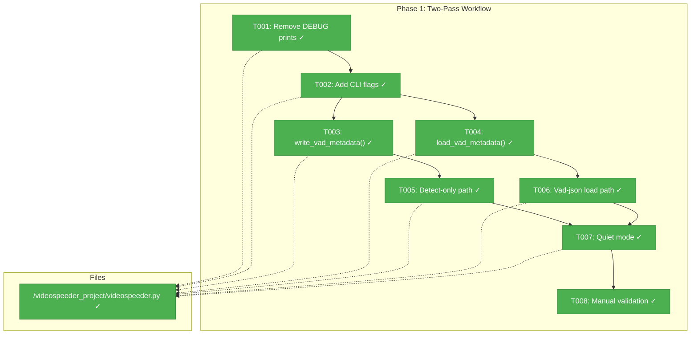
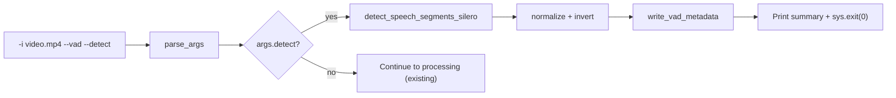
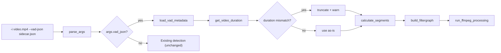
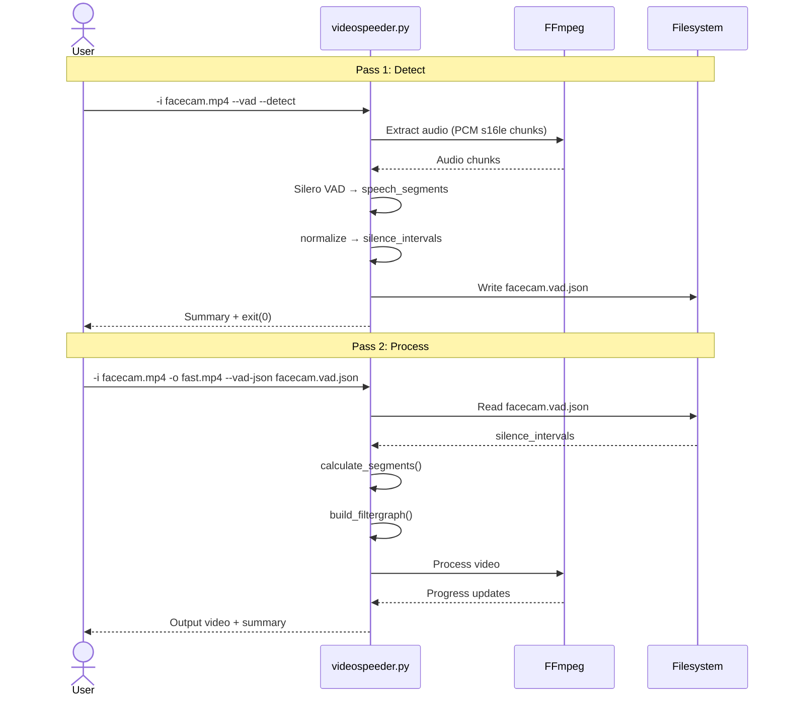

# Phase 1: Two-Pass Workflow + Output Cleanup — Tasks & Alignment Brief

**Spec**: [../../vad-first-pass-multi-angle-spec.md](../../vad-first-pass-multi-angle-spec.md)
**Plan**: [../../vad-first-pass-multi-angle-plan.md](../../vad-first-pass-multi-angle-plan.md)
**Workshop**: [../../workshops/workflow-and-cli-design.md](../../workshops/workflow-and-cli-design.md)
**Date**: 2026-02-22

---

## Executive Briefing

### Purpose
This phase decouples VAD detection from video processing into a two-pass workflow. Users can run detection separately, inspect the results as a `.vad.json` sidecar file, then process the video using that sidecar — without re-running detection. This is the foundation for multi-angle batch processing in Phase 2.

### What We're Building
Three new capabilities on the existing `videospeeder.py` command:
- **Detect-only mode** (`--detect`): Runs silence detection (Silero VAD or silencedetect), writes a `.vad.json` sidecar next to the input, and exits without encoding
- **Process-from-sidecar mode** (`--vad-json path`): Loads silence intervals from a sidecar file instead of running detection, then processes the video normally
- **Quiet mode** (`--quiet`): Suppresses verbose terminal output — only progress bar and summary remain

Plus cleanup: removal of `[DEBUG]` development artifacts from `main()`.

### User Value
Creators can inspect and iterate on detection results before committing to a long encode. Re-running with different processing params (buffer, speed) doesn't require re-running detection. This also sets up Phase 2's multi-angle workflow where one sidecar drives processing of multiple camera angles.

### Example
```
# Step 1: Detect (writes sidecar, exits)
$ python videospeeder.py -i facecam.mp4 --vad --detect
  Wrote: facecam.vad.json (73.4% speech, 141 silence intervals)

# Step 2: Process (reads sidecar, skips detection)
$ python videospeeder.py -i facecam.mp4 -o fast.mp4 --vad-json facecam.vad.json
  Loading VAD metadata from facecam.vad.json (skipping detection)
  Processing: 100%|████████████████| 3842/3842 [08:23<00:00]
```

---

## Objectives & Scope

### Objective
Implement detect-only and process-from-sidecar modes with clean terminal output, while preserving full backward compatibility with existing `--vad` single-pass workflow.

### Goals

- ✅ `--detect` writes `.vad.json` sidecar and exits (AC-1, AC-2)
- ✅ `--vad-json` loads sidecar, skips detection, processes video (AC-3)
- ✅ Duration mismatch between sidecar and video handled gracefully (AC-4)
- ✅ Sidecar version check with clear error on mismatch (AC-5)
- ✅ `--vad` and `--vad-json` mutually exclusive via argparse (AC-6)
- ✅ `--quiet` suppresses verbose output (AC-13)
- ✅ `[DEBUG]` prints removed from main() (AC-16)
- ✅ Existing `--vad` single-pass workflow unchanged (AC-15)

### Non-Goals

- ❌ Folder/batch processing (Phase 2)
- ❌ `--vad-master` one-liner mode (Phase 2)
- ❌ Auto-discovery of sidecar files (Phase 2)
- ❌ Modifying build_filtergraph() or run_ffmpeg_processing()
- ❌ Adding unit tests (spec: Manual Only)
- ❌ Modifying detection functions (detect_speech_segments_silero, run_silencedetect, etc.)
- ❌ Creating new script files (all changes in videospeeder.py)

---

## Pre-Implementation Audit

### Summary
| File | Action | Origin | Modified By | Recommendation |
|------|--------|--------|-------------|----------------|
| `/home/jak/github/videospeeder/videospeeder_project/videospeeder.py` | Modify | Pre-plan (original codebase) | Phase 1 (T001-T007) | keep-as-is |

### Compliance Check
No violations found. All changes respect architecture layer boundaries:
- parse_args() modifications stay in Argument Parser layer
- New helper functions sit between Orchestration and Detection layers
- build_filtergraph() and run_ffmpeg_processing() are untouched (protected zone)

### Reuse Opportunities
- **vad_dump.py** (lines 88-97): Payload construction pattern for `write_vad_metadata()` — use `[[s,e],...]` compact format per workshop
- **Existing detection functions**: All 6 public API functions reused without modification
- **Lazy import pattern**: `import_vad_dependencies()` already gates torch loading

---

## Requirements Traceability

### Coverage Matrix
| AC | Description | Flow Summary | Files in Flow | Tasks | Status |
|----|-------------|-------------|---------------|-------|--------|
| AC-1 | `--vad --detect` writes .vad.json and exits | parse_args→main detect path→detect_speech_segments_silero→write_vad_metadata→exit | videospeeder.py | T002,T003,T005 | ✅ Covered |
| AC-2 | `--detect` (no --vad) writes sidecar with silencedetect | parse_args→main detect path→run_silencedetect→write_vad_metadata→exit | videospeeder.py | T002,T003,T005 | ✅ Covered |
| AC-3 | `--vad-json` loads sidecar, processes video | parse_args→main load path→load_vad_metadata→calculate_segments→process | videospeeder.py | T002,T004,T006 | ✅ Covered |
| AC-4 | Duration mismatch truncates and warns | load_vad_metadata→get_video_duration→truncate_intervals→warn | videospeeder.py | T006 | ✅ Covered |
| AC-5 | Unsupported version rejects | load_vad_metadata→version check→sys.exit(1) | videospeeder.py | T004 | ✅ Covered |
| AC-6 | `--vad`+`--vad-json` mutual exclusion | argparse mutually_exclusive_group→error before main | videospeeder.py | T002 | ✅ Covered |
| AC-13 | `--quiet` suppresses verbose output | parse_args→main conditional gates on prints | videospeeder.py | T002,T007 | ✅ Covered |
| AC-14 | No overlays without `--indicator` | build_filtergraph checks `if indicator:` (line 741) | videospeeder.py | -- (verify only) | ✅ Already compliant |
| AC-15 | Backward compat preserved | Existing code paths unchanged when no new flags used | videospeeder.py | T001,T007 | ✅ Covered |
| AC-16 | No `[DEBUG]` without `--debug-segments` | Remove [DEBUG] prints from main() | videospeeder.py | T001 | ✅ Covered |

### Gaps Found
None — all acceptance criteria have complete file coverage.

---

## Architecture Map

### Component Diagram
<!-- Status: grey=pending, orange=in-progress, green=completed, red=blocked -->
<!-- Updated by plan-6 during implementation -->



### Task-to-Component Mapping

| Task | Component(s) | Status | Comment |
|------|-------------|--------|---------|
| T001 | main() cleanup | ✅ Complete | Removed 8 [DEBUG] lines + args dump. Error msgs now to stderr. |
| T002 | parse_args() + main() | ✅ Complete | 3 flags added, mutual exclusion group, validation matrix |
| T003 | New functions | ✅ Complete | write_vad_metadata() + silence_intervals_to_speech_segments() |
| T004 | New functions | ✅ Complete | load_vad_metadata() + truncate_intervals_to_duration() |
| T005 | main() new path | ✅ Complete | Detect-only branch (both backends), always prints summary |
| T006 | main() new path | ✅ Complete | Vad-json loading, duration mismatch truncation + warning |
| T007 | main() gates | ✅ Complete | Quiet gates on segments, filtergraph, codec info |
| T008 | Manual testing | ✅ Complete | 9/10 ACs pass; AC-1 (VAD detect) untestable without torch |

---

## Tasks

| Status | ID | Task | CS | Type | Dependencies | Absolute Path(s) | Validation | Subtasks | Notes |
|--------|-----|------|----|------|--------------|------------------|------------|----------|-------|
| [x] | T001 | Remove `[DEBUG]` prints and development artifacts from main(). Remove lines: 960-962 (args dump), 964-966 (cwd), 974 (probe debug), 981/985 (ffmpeg/ffprobe debug), 990/994 (file exists debug), 1126 (exception debug). Keep actual error messages (982, 986, 991). | 1 | Cleanup | -- | /home/jak/github/videospeeder/videospeeder_project/videospeeder.py | No `[DEBUG]` prefixed lines in output without `--debug-segments` (AC-16). Error messages still print. | -- | |
| [x] | T002 | Add `--detect`, `--vad-json`, `--quiet` flags to parse_args(). Create mutually exclusive group for `--vad` vs `--vad-json`. Remove `required=True` from `-i` and `-o`. Add explicit validation matrix at top of main() with mode→required-args table and clear error messages (e.g., `--detect` needs `-i`; `--vad-json` needs `-i` and `-o`; normal processing needs `-i` and `-o`). | 2 | Core | T001 | /home/jak/github/videospeeder/videospeeder_project/videospeeder.py | `--vad --vad-json path` → argparse error (AC-6). All three new flags accepted. `-i`/`-o` no longer hard-required. Clear error for each missing-arg case. | -- | Mutually exclusive group via `parser.add_mutually_exclusive_group()`. Validation matrix: `--detect` → `-i` required, `-o` ignored; `--vad-json` → `-i`,`-o` required; default → `-i`,`-o` required. Per DYK #2. |
| [x] | T003 | Implement `write_vad_metadata()` function. Writes `.vad.json` sidecar next to input video (stem + `.vad.json`). Schema v1 per workshop: `version`, `source.file` (basename), `detection.backend`, `detection.analyzed_duration`, `detection.params`, `speech_segments` as `[[s,e],...]`, `silence_intervals` as `[[s,e],...]`. Support both `silero` and `silencedetect` backends. For silencedetect, compute speech_segments via new `silence_intervals_to_speech_segments(intervals, duration)` helper (~10 lines, mirror of existing inverse function). Catch write permission errors with clear message guiding user. | 2 | Core | T002 | /home/jak/github/videospeeder/videospeeder_project/videospeeder.py | Writes valid v1 `.vad.json` with all fields from AC-1. File created next to input. Both backends produce valid sidecar (AC-2). Permission error caught with clear message. | -- | Model on vad_dump.py payload pattern (PL-03). Use compact `[[s,e]]` format per workshop. Includes `silence_intervals_to_speech_segments()` helper per DYK #4. Permission handling per DYK #5. |
| [x] | T004 | Implement `load_vad_metadata()` function. Reads `.vad.json`, validates version==1, returns `(silence_intervals, analyzed_duration)`. Convert `[[s,e],...]` arrays back to `List[Tuple[float,float]]`. Print error and `sys.exit(1)` for unsupported versions. | 2 | Core | T002 | /home/jak/github/videospeeder/videospeeder_project/videospeeder.py | Loads silence_intervals from valid sidecar. Rejects version!=1 with `"Unsupported vad.json version: N"` and exit(1) (AC-5). | -- | |
| [x] | T005 | Add detect-only code path in main(). When `--detect` is set: validate `-i` required, run detection (Silero if `--vad`, silencedetect otherwise), call `write_vad_metadata()`, **always** print detection summary (speech %, silence count, sidecar path) regardless of `--quiet`, exit via `sys.exit(0)`. Validate that `--detect` + `--vad-json` is an error. | 2 | Core | T003 | /home/jak/github/videospeeder/videospeeder_project/videospeeder.py | `--vad --detect` writes sidecar and exits (AC-1). `--detect` alone uses silencedetect (AC-2). No video processing runs. Summary always printed (even with --quiet). | -- | Insert before existing detection code in main(). Exit before calculate_segments/build_filtergraph. Detect summary is the result, not verbose noise — always print per DYK #3. |
| [x] | T006 | Add `--vad-json` loading code path in main(). When `--vad-json` is set: call `load_vad_metadata()`, get actual video duration via new `get_video_duration()` helper (~5 lines, ffprobe one-liner returning float seconds), compare durations, truncate intervals if mismatch > 1s with warning, skip detection branches, proceed to `calculate_segments()`. Implement `truncate_intervals_to_duration()` helper. | 2 | Core | T004 | /home/jak/github/videospeeder/videospeeder_project/videospeeder.py | `--vad-json path` loads sidecar and processes (AC-3). Duration mismatch truncates + warns (AC-4). Prints `"Loading VAD metadata from X (skipping detection)"`. | -- | `get_video_duration()`: lightweight ffprobe wrapper per DYK #1. `truncate_intervals_to_duration()`: skip intervals past max_duration, clamp end to max_duration. |
| [x] | T007 | Implement `--quiet` mode. Gate verbose output behind `not args.quiet`: probe_and_print_video_stats() call (line 975), silence interval listing, segment listing, filtergraph preview, args dump (already removed by T001). Keep progress bar (tqdm) and final summary. Errors always print to stderr. | 1 | Core | T005, T006 | /home/jak/github/videospeeder/videospeeder_project/videospeeder.py | With `--quiet`: no stats table, no interval list, no segments, no filtergraph (AC-13). Progress bar + summary still show. Errors still print. | -- | |
| [x] | T008 | Manual validation of Phase 1 acceptance criteria using staging videos from `~/VideoMedia/SoloXC/working/`. Test: AC-1 (detect VAD), AC-2 (detect silencedetect), AC-3 (process from sidecar), AC-4 (duration mismatch), AC-5 (version check), AC-6 (mutual exclusion), AC-13 (quiet), AC-14 (clean output), AC-15 (backward compat — `--vad` alone), AC-16 (no debug). | 1 | Validation | T007 | -- | All tested ACs pass with real video files. No regressions in existing functionality. | -- | Use `~/VideoMedia/SoloXC/working/Angle 1.mp4` and `Angle 2.mp4`. |

---

## Alignment Brief

### Critical Findings Affecting This Phase

| # | Finding | Constraint | Addressed by |
|---|---------|-----------|-------------|
| 01 | Chunk boundary stitching (PL-01) | Reuse existing `detect_speech_segments_silero()` — never reimplement | T005 calls existing function |
| 02 | Coordinate alignment (PL-02) | Sidecar must store offset and analyzed_duration | T003 stores in detection section |
| 03 | vad_dump.py template (PL-03) | Model sidecar writer on vad_dump.py payload pattern | T003 follows pattern |
| 05 | Sidecar stores intervals not segments (Finding 05) | Pipeline segments computed at processing time | T003 stores silence_intervals only |
| 06 | [DEBUG] prints are artifacts (Finding 06) | Remove all before new code paths | T001 cleans up |
| 07 | Lazy import pattern (PL-04) | torch only imported when --vad used | T005 uses existing conditional |
| 10 | -i/-o required=True (Finding 10) | Must remove and validate manually | T002 handles |
| 11 | build_filtergraph fragile (Finding 11) | DO NOT TOUCH | No tasks modify it |

### Invariants & Guardrails

- **Protected zone**: Lines 669-956 (build_filtergraph + run_ffmpeg_processing) — zero modifications
- **Detection functions**: Lines 190-615 — zero modifications, reuse only
- **Backward compatibility**: `videospeeder.py -i in.mp4 -o out.mp4 --vad` must behave identically to pre-change
- **Error output**: Always to stderr, never suppressed by `--quiet`

### Data Flow: Detect-Only Mode



### Data Flow: Process-from-Sidecar Mode



### Sequence Diagram: Two-Pass Workflow



### Test Plan (Manual Only)

| Test | Command | Expected | AC |
|------|---------|----------|-----|
| Detect with VAD | `python videospeeder.py -i "Angle 1.mp4" --vad --detect` | Creates `Angle 1.vad.json`, prints summary, exits | AC-1 |
| Detect with silencedetect | `python videospeeder.py -i "Angle 1.mp4" --detect` | Creates `Angle 1.vad.json` with backend=silencedetect | AC-2 |
| Process from sidecar | `python videospeeder.py -i "Angle 1.mp4" -o out.mp4 --vad-json "Angle 1.vad.json"` | Skips detection, processes normally | AC-3 |
| Duration mismatch | Use Angle 1's sidecar with Angle 2 | Truncates/warns if durations differ | AC-4 |
| Bad version | Edit sidecar to version:99 | Error + exit(1) | AC-5 |
| Mutual exclusion | `--vad --vad-json path` | Argparse error | AC-6 |
| Quiet mode | Add `--quiet` to process command | No stats/intervals/filtergraph | AC-13 |
| Clean output | Process without `--indicator` | No overlays in output video | AC-14 |
| Backward compat | `python videospeeder.py -i "Angle 1.mp4" -o out.mp4 --vad` | Identical to pre-change behavior | AC-15 |
| No debug output | Process without `--debug-segments` | No `[DEBUG]` in output | AC-16 |

### Implementation Outline

1. **T001**: Delete ~8 `[DEBUG]` print lines in main(). Verify no debug output.
2. **T002**: Restructure parse_args() — add 3 flags, create mutual exclusion group, remove required=True from -i/-o. Add manual validation block at top of main().
3. **T003**: Write `write_vad_metadata()` function (~30 lines). Place before main(). Follow vad_dump.py payload pattern with compact `[[s,e]]` format.
4. **T004**: Write `load_vad_metadata()` function (~20 lines). Place near write_vad_metadata(). Version check + conversion.
5. **T005**: Add `if args.detect:` block at start of main() (after validation). Run detection using existing functions, call write_vad_metadata(), print summary, sys.exit(0).
6. **T006**: Add `if args.vad_json:` block before existing `if args.vad:` / `else:` detection code. Load sidecar, check duration, truncate if needed. Write `truncate_intervals_to_duration()` helper (~10 lines).
7. **T007**: Wrap verbose prints in `if not args.quiet:` guards. Keep progress bar and errors.
8. **T008**: Run all manual tests with staging videos.

### Commands to Run

```bash
# Activate venv (for --vad mode)
source .venv-vad/bin/activate

# Test detect-only (VAD)
python videospeeder_project/videospeeder.py -i ~/VideoMedia/SoloXC/working/"Angle 1.mp4" --vad --detect

# Test detect-only (silencedetect)
python videospeeder_project/videospeeder.py -i ~/VideoMedia/SoloXC/working/"Angle 1.mp4" --detect

# Test process from sidecar
python videospeeder_project/videospeeder.py -i ~/VideoMedia/SoloXC/working/"Angle 1.mp4" -o ~/VideoMedia/SoloXC/working/output/"Angle 1.mp4" --vad-json ~/VideoMedia/SoloXC/working/"Angle 1.vad.json"

# Test backward compat
python videospeeder_project/videospeeder.py -i ~/VideoMedia/SoloXC/working/"Angle 1.mp4" -o ~/VideoMedia/SoloXC/working/output/"Angle 1.mp4" --vad --process-duration 30

# Test mutual exclusion
python videospeeder_project/videospeeder.py -i test.mp4 --vad --vad-json test.vad.json

# Test quiet mode
python videospeeder_project/videospeeder.py -i ~/VideoMedia/SoloXC/working/"Angle 1.mp4" -o /tmp/test.mp4 --vad-json ~/VideoMedia/SoloXC/working/"Angle 1.vad.json" --quiet --process-duration 30
```

### Risks
| Risk | Likelihood | Impact | Mitigation |
|------|------------|--------|------------|
| Removing required=True from -i/-o breaks existing CLI | Medium | High | Validate manually in main(); test AC-15 immediately after T007 |
| Silencedetect sidecar needs speech_segments field | Low | Low | Invert silence_intervals to compute speech; simple helper |
| Quiet mode accidentally suppresses errors | Low | Medium | Only gate informational prints; errors always to stderr |

### Ready Check

- [ ] Spec reviewed (16 ACs understood)
- [ ] Plan reviewed (findings, constraints, phasing)
- [ ] Workshop reviewed (sidecar schema, CLI flows, flag matrix)
- [ ] Staging videos available at `~/VideoMedia/SoloXC/working/`
- [ ] venv available (`.venv-vad/`)
- [ ] No ADR constraints (none exist)
- [ ] **GO / NO-GO**: Awaiting human approval

---

## Phase Footnote Stubs

| Footnote | Task | Summary | Nodes |
|----------|------|---------|-------|
| [^1] | T001 | Removed [DEBUG] prints from main() | `file:videospeeder_project/videospeeder.py` |
| [^2] | T002 | Added CLI flags and validation matrix | `function:videospeeder_project/videospeeder.py:parse_args`, `function:videospeeder_project/videospeeder.py:main` |
| [^3] | T003/T004 | Implemented sidecar read/write functions | `function:videospeeder_project/videospeeder.py:silence_intervals_to_speech_segments`, `function:videospeeder_project/videospeeder.py:write_vad_metadata`, `function:videospeeder_project/videospeeder.py:load_vad_metadata`, `function:videospeeder_project/videospeeder.py:truncate_intervals_to_duration` |
| [^4] | T005 | Added detect-only code path in main() | `function:videospeeder_project/videospeeder.py:main` |
| [^5] | T006 | Added --vad-json loading code path in main() | `function:videospeeder_project/videospeeder.py:main` |
| [^6] | T007 | Added --quiet mode output suppression | `function:videospeeder_project/videospeeder.py:main` |

---

## Evidence Artifacts

- **Execution log**: `./execution.log.md` (created by plan-6 during implementation)
- **Sidecar samples**: Generated during T008 validation in `~/VideoMedia/SoloXC/working/`

---

## Discoveries & Learnings

_Populated during implementation by plan-6. Log anything of interest to your future self._

| Date | Task | Type | Discovery | Resolution | References |
|------|------|------|-----------|------------|------------|
| 2026-02-22 | T001 | insight | `get_video_duration()` already exists at line 190 — DYK #1 was a false positive | No new function needed for T006, used existing one | log#task-t001 |
| 2026-02-22 | T003 | decision | Combined T003+T004 implementation — functions are co-located and interdependent | Wrote all 4 helper functions together | log#task-t003 |
| 2026-02-22 | T003 | decision | Moved truncate_intervals_to_duration() from T006 scope to T003 — pure helper near related functions | Implemented with other sidecar helpers | log#task-t003 |
| 2026-02-22 | T008 | gotcha | "Loading VAD metadata" message leaked through --quiet mode | Added `if not args.quiet:` guard during T008 validation | log#task-t008 |
| 2026-02-22 | T008 | insight | run_ffmpeg_processing() prints are in protected zone, cannot be suppressed by --quiet | Acceptable — encoding pipeline output is useful | log#task-t008 |

**Types**: `gotcha` | `research-needed` | `unexpected-behavior` | `workaround` | `decision` | `debt` | `insight`

_See also: `execution.log.md` for detailed narrative._

---

## Critical Insights (2026-02-22)

| # | Insight | Decision |
|---|---------|----------|
| 1 | T006 references `get_video_duration()` but no task creates it; existing probe function prints to terminal | Fold `get_video_duration()` helper into T006 scope (~5 lines, ffprobe wrapper) |
| 2 | Removing `required=True` from -i/-o creates risk of confusing errors without explicit validation matrix | Add explicit mode→required-args validation block at top of main() with clear error messages |
| 3 | `--quiet` + `--detect` suppresses the detection summary — the entire point of detect mode | `--detect` always prints its summary line regardless of `--quiet` |
| 4 | Silencedetect sidecar needs speech_segments but only the reverse helper exists | Add `silence_intervals_to_speech_segments()` helper in T003 (~10 lines) |
| 5 | `--detect` writes sidecar next to input; user may not have write permissions (NAS, external drive) | Catch permission errors with clear message guiding the user |

Action items: All 5 folded into task descriptions (T002, T003, T005, T006 updated).

---

## Directory Layout

```
docs/plans/007-vad-first-pass-multi-angle/
├── vad-first-pass-multi-angle-spec.md
├── vad-first-pass-multi-angle-plan.md
├── research-dossier.md
├── workshops/
│   └── workflow-and-cli-design.md
└── tasks/
    ├── phase-1-two-pass-workflow-output-cleanup/
    │   ├── tasks.md              ← this file
    │   ├── tasks.fltplan.md      ← flight plan
    │   └── execution.log.md     ← created by plan-6
    └── phase-2-folder-processing/
        ├── tasks.md
        ├── tasks.fltplan.md
        └── execution.log.md
```
