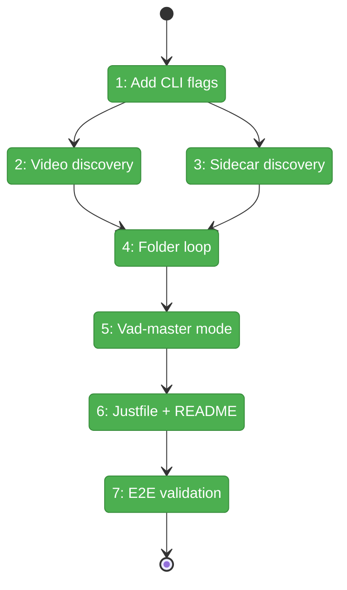
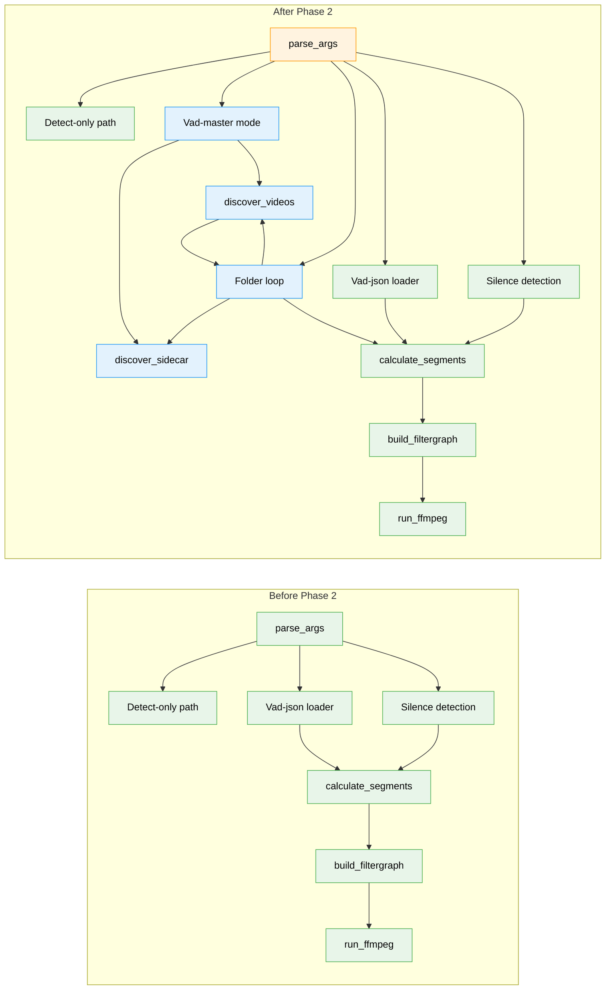

# Flight Plan: Phase 2 — Folder Processing

**Plan**: [../../vad-first-pass-multi-angle-plan.md](../../vad-first-pass-multi-angle-plan.md)
**Dossier**: [./tasks.md](./tasks.md)
**Phase**: Phase 2: Folder Processing
**Generated**: 2026-02-22
**Status**: Landed

---

## Departure → Destination

**Where we are**: Phase 1 gave videospeeder a two-pass workflow — detect speech once and write a `.vad.json` sidecar, then process from that sidecar with `--vad-json`. A `--quiet` flag cleans up terminal output. But each video must still be processed individually by passing `-i` and `-o` one file at a time.

**Where we're going**: By the end of this phase, a content creator can point videospeeder at a folder of multi-angle recordings and process them all in one command. The tool discovers videos, finds the sidecar, handles duration mismatches per-file, skips already-processed outputs, and keeps going if one file fails. A `--vad-master` flag combines detection and folder processing into a single command.

---

## Flight Status

<!-- Updated by /plan-6: pending → active → done. Use blocked for problems/input needed. -->

**Legend**: grey = pending | yellow = active | red = blocked/needs input | green = done

---

## Stages

<!-- Updated by /plan-6 during implementation: [ ] → [~] → [x] -->

- [x] **Stage 1: Add folder CLI flags** — add `--folder`, `--vad-master`, `--overwrite`, `--extensions` to argparse and extend the validation matrix (`videospeeder.py`)
- [x] **Stage 2: Implement video discovery** — scan a folder for files matching video extensions, sorted alphabetically (`videospeeder.py`)
- [x] **Stage 3: Implement sidecar discovery** — find exactly one `.vad.json` or error clearly if zero or multiple found (`videospeeder.py`)
- [x] **Stage 4: Implement folder processing loop** — process all discovered videos sequentially with shared sidecar, skip existing outputs, continue on failure, print summary (`videospeeder.py`)
- [x] **Stage 5: Implement vad-master one-liner** — detect on a named master file then process the entire folder in one command (`videospeeder.py`)
- [x] **Stage 6: Justfile recipes + README update** — add `detect`, `speed-folder`, `speed-all` recipes and document new flags with multi-angle examples (`Justfile`, `README.md`)
- [x] **Stage 7: End-to-end validation** — full regression pass of all 16 acceptance criteria with real multi-angle video files

---

## Architecture: Before & After

**Legend**: existing (green, unchanged) | changed (orange, modified) | new (blue, created)

---

## Acceptance Criteria

- [ ] AC-7: Folder mode processes all videos with shared sidecar
- [ ] AC-8: Folder mode auto-discovers single sidecar
- [ ] AC-9: Folder mode errors on ambiguous (multiple) sidecars
- [ ] AC-10: `--vad-master` does detect + process in one command
- [ ] AC-11: Folder mode skips existing outputs (respects `--overwrite`)
- [ ] AC-12: Folder mode continues on single-file failure
- [ ] AC-1–AC-6, AC-13–AC-16: Full regression pass

---

## Goals & Non-Goals

**Goals**:
- `--folder`, `--vad-master`, `--overwrite`, `--extensions` flags on CLI
- Auto-discover single `.vad.json` sidecar in folder
- Process all matching videos sequentially with shared sidecar
- Skip existing outputs by default; `--overwrite` re-processes
- Continue on single-file failure with summary
- `--vad-master` combines detect + folder in one command
- Justfile recipes and README docs for multi-angle workflow

**Non-Goals**:
- Parallel video encoding (FFmpeg uses multiple cores)
- Per-angle time offset correction (NLE handles sync)
- Interactive confirmation (never prompt)
- Recursive folder scanning (flat only)
- Unit tests or mocks (Manual Only)

---

## Checklist

- [x] T009: Add `--folder`, `--vad-master`, `--overwrite`, `--extensions` flags (CS-1)
- [x] T010: Implement `discover_videos()` helper (CS-1)
- [x] T011: Implement `discover_sidecar()` helper (CS-1)
- [x] T012: Implement folder processing loop in main() (CS-3)
- [x] T013: Implement `--vad-master` one-liner mode (CS-2)
- [x] T014: Add Justfile recipes (CS-1)
- [x] T015: Update README.md (CS-2)
- [x] T016: End-to-end validation (CS-1)

---

## PlanPak

Not active for this plan.
