# Phase 2: Folder Processing — Tasks & Alignment Brief

**Spec**: [../../vad-first-pass-multi-angle-spec.md](../../vad-first-pass-multi-angle-spec.md)
**Plan**: [../../vad-first-pass-multi-angle-plan.md](../../vad-first-pass-multi-angle-plan.md)
**Workshop**: [../../workshops/workflow-and-cli-design.md](../../workshops/workflow-and-cli-design.md)
**Date**: 2026-02-22

---

## Executive Briefing

### Purpose
This phase enables batch processing of all videos in a folder using a shared VAD sidecar, completing the multi-angle workflow. Without this, content creators must run videospeeder individually on each camera angle — tedious and error-prone for keeping sync.

### What We're Building
A folder processing mode (`--folder`) that:
- Discovers all video files in a directory
- Auto-discovers or accepts a shared `.vad.json` sidecar
- Processes each video sequentially with identical timing
- Skips already-processed outputs (respects `--overwrite`)
- Continues on single-file failures with a final summary
- Supports one-liner mode (`--vad-master`) combining detect + process

### User Value
A content creator with 3-4 camera angles goes from a multi-step manual process to either a 2-command workflow (detect + folder) or a single command (`--vad-master`). All output files have identical timing for perfect NLE sync.

### Example
**Before (manual, per-file):**
```bash
python videospeeder.py -i dir/facecam.mp4 -o dir/out/facecam.mp4 --vad-json dir/facecam.vad.json
python videospeeder.py -i dir/screen.mp4 -o dir/out/screen.mp4 --vad-json dir/facecam.vad.json
python videospeeder.py -i dir/overhead.mp4 -o dir/out/overhead.mp4 --vad-json dir/facecam.vad.json
```

**After (one command):**
```bash
python videospeeder.py --folder dir/ --vad-json dir/facecam.vad.json -o dir/output/
```

---

## Objectives & Scope

### Objective
Implement folder-based batch processing with auto-discovery, skip-existing, continue-on-failure, and one-liner detect+process mode.

### Goals

- ✅ `--folder`, `--vad-master`, `--overwrite`, `--extensions` flags added to CLI
- ✅ Auto-discover single `.vad.json` sidecar in folder
- ✅ Error clearly on zero or multiple sidecars (AC-8, AC-9)
- ✅ Process all matching videos sequentially with shared sidecar (AC-7)
- ✅ Skip existing outputs by default; `--overwrite` re-processes (AC-11)
- ✅ Continue on single-file failure with summary (AC-12)
- ✅ `--vad-master` combines detect + folder process in one command (AC-10)
- ✅ Justfile recipes for new workflows
- ✅ README.md documents new flags and multi-angle workflow

### Non-Goals

- ❌ Parallel video encoding (FFmpeg already uses multiple cores)
- ❌ Per-angle time offset correction (NLE's job, deferred per OQ-2)
- ❌ Interactive confirmation before processing (resolved: never prompt, OQ-3)
- ❌ Recursive folder scanning (flat directory only)
- ❌ Audio fingerprint sync verification (out of scope per spec)
- ❌ Unit tests or mocks (Manual Only testing strategy)
- ❌ Modifying `build_filtergraph()` or `run_ffmpeg_processing()` (protected zones)

---

## Pre-Implementation Audit

### Summary
| File | Action | Origin | Modified By | Recommendation |
|------|--------|--------|-------------|----------------|
| `/home/jak/github/videospeeder/videospeeder_project/videospeeder.py` | Modify | Pre-plan | Phase 1 (T001-T007) | keep-as-is |
| `/home/jak/github/videospeeder/Justfile` | Modify | Pre-plan | — | keep-as-is |
| `/home/jak/github/videospeeder/README.md` | Modify | Pre-plan | — | keep-as-is |

### Compliance Check
No compliance violations found. No `docs/adr/`, `docs/project-rules/rules.md`, or `docs/project-rules/architecture.md` constraints apply. The `docs/project-rules/idioms.md` convention of no TDD/no mocks aligns with Manual Only testing.

---

## Requirements Traceability

### Coverage Matrix
| AC | Description | Flow Summary | Files in Flow | Tasks | Status |
|----|-------------|-------------|---------------|-------|--------|
| AC-7 | Folder mode processes all videos with shared sidecar | parse_args → main() folder branch → discover_videos → per-video loop → load_vad → truncate → calculate_segments → build_filtergraph → run_ffmpeg | videospeeder.py | T009, T010, T012 | ⏭️ Pending |
| AC-8 | Folder mode auto-discovers single sidecar | discover_sidecar() → glob *.vad.json → exactly one → return | videospeeder.py | T011, T012 | ⏭️ Pending |
| AC-9 | Folder mode errors on ambiguous (multiple) sidecars | discover_sidecar() → glob → multiple → error with list | videospeeder.py | T011, T012 | ⏭️ Pending |
| AC-10 | `--vad-master` does detect + process in one command | parse_args → vad-master branch → detect on master → write sidecar → folder loop | videospeeder.py | T009, T013 | ⏭️ Pending |
| AC-11 | Folder mode skips existing outputs (respects --overwrite) | folder loop → check output exists → skip or overwrite | videospeeder.py | T009, T012 | ⏭️ Pending |
| AC-12 | Folder mode continues on single-file failure | folder loop → try/except per video → log error → continue → summary | videospeeder.py | T012 | ⏭️ Pending |

### Gaps Found
No gaps. All ACs have complete task coverage.

### Orphan Files
| File | Tasks | Assessment |
|------|-------|------------|
| Justfile | T014 | Tooling — convenience recipes for new workflows |
| README.md | T015 | Documentation — per Documentation Strategy |

---

## Architecture Map

### Component Diagram

```mermaid
flowchart TD
    classDef pending fill:#9E9E9E,stroke:#757575,color:#fff
    classDef inprogress fill:#FF9800,stroke:#F57C00,color:#fff
    classDef completed fill:#4CAF50,stroke:#388E3C,color:#fff
    classDef blocked fill:#F44336,stroke:#D32F2F,color:#fff

    style Phase fill:#F5F5F5,stroke:#E0E0E0
    style Files fill:#F5F5F5,stroke:#E0E0E0

    subgraph Phase["Phase 2: Folder Processing"]
        T009["T009: Add CLI flags ✓"]:::completed
        T010["T010: discover_videos() ✓"]:::completed
        T011["T011: discover_sidecar() ✓"]:::completed
        T012["T012: Folder processing loop ✓"]:::completed
        T013["T013: --vad-master mode ✓"]:::completed
        T014["T014: Justfile recipes ✓"]:::completed
        T015["T015: README.md update ✓"]:::completed
        T016["T016: E2E validation ✓"]:::completed

        T009 --> T010
        T009 --> T011
        T010 --> T012
        T011 --> T012
        T012 --> T013
        T013 --> T014
        T013 --> T015
        T014 --> T016
        T015 --> T016
    end

    subgraph Files["Files"]
        F1["videospeeder.py"]:::pending
        F2["Justfile ✓"]:::completed
        F3["README.md ✓"]:::completed
    end

    T009 -.-> F1
    T010 -.-> F1
    T011 -.-> F1
    T012 -.-> F1
    T013 -.-> F1
    T014 -.-> F2
    T015 -.-> F3
```

<!-- Status: grey=pending, orange=in-progress, green=completed, red=blocked -->
<!-- Updated by plan-6 during implementation -->



### Task-to-Component Mapping

<!-- Status: ⬜ Pending | 🟧 In Progress | ✅ Complete | 🔴 Blocked -->

| Task | Component(s) | Files | Status | Comment |
|------|-------------|-------|--------|---------|
| T009 | CLI / parse_args() | videospeeder.py | ✅ Complete | Added 4 flags + validation matrix with DYK #1 fix |
| T010 | Helper / discover_videos() | videospeeder.py | ✅ Complete | Scans folder, filters by extension, excludes .vad.json |
| T011 | Helper / discover_sidecar() | videospeeder.py | ✅ Complete | Exactly one → return; zero/multiple → error+exit |
| T012 | Orchestration / main() | videospeeder.py | ✅ Complete | Folder loop with DYK #2/#3/#4 fixes, skip/continue/summary |
| T013 | Orchestration / main() | videospeeder.py | ✅ Complete | Detect on master → write sidecar → folder loop |
| T014 | Tooling / Justfile | Justfile | ✅ Complete | Added detect, speed-folder, speed-all recipes |
| T015 | Documentation / README | README.md | ✅ Complete | Added Phase 1+2 flags + multi-angle workflow section |
| T016 | Validation | -- | ✅ Complete | All AC-7 through AC-12 verified + Phase 1 regression |

---

## Tasks

| Status | ID | Task | CS | Type | Dependencies | Absolute Path(s) | Validation | Subtasks | Notes |
|--------|-----|------|----|------|--------------|------------------|------------|----------|-------|
| [x] | T009 | Add `--folder`, `--vad-master`, `--overwrite`, `--extensions` flags to parse_args(); add folder-mode validation to main() | 1 | Core | T008 | /home/jak/github/videospeeder/videospeeder_project/videospeeder.py | All four flags accepted; `--extensions` defaults to `mp4,mkv,mov,avi,webm`; `--folder`+`--vad` without `--vad-master` → error; `--folder` requires `-o`; `--folder`+`--detect` → error | – | Extend validation matrix at lines 1058-1085. **DYK #1**: Must also guard `os.path.isfile(args.input)` at lines 1094-1097 with `if args.input:` — folder mode has no -i, so args.input is None and os.path.isfile(None) raises TypeError. |
| [x] | T010 | Implement `discover_videos(folder, extensions)` helper function | 1 | Core | T009 | /home/jak/github/videospeeder/videospeeder_project/videospeeder.py | Returns sorted list of video file paths matching extensions; excludes `*.vad.json` files; empty list if no matches | – | Place between truncate_intervals_to_duration() and calculate_segments(). Default extensions: mp4,mkv,mov,avi,webm. |
| [x] | T011 | Implement `discover_sidecar(folder)` helper function | 1 | Core | T009 | /home/jak/github/videospeeder/videospeeder_project/videospeeder.py | Exactly one `.vad.json` → returns path + prints which file found (AC-8); zero → prints error to stderr + exit(1); multiple → prints error listing found files + exit(1) (AC-9) | – | Place next to discover_videos(). |
| [x] | T012 | Implement folder processing loop in main() | 3 | Core | T010, T011 | /home/jak/github/videospeeder/videospeeder_project/videospeeder.py | `--folder dir/ --vad-json sidecar -o dir/output/`: processes all videos sequentially (AC-7). Skips existing outputs unless `--overwrite` (AC-11). Continues on single-file failure (AC-12). Creates output dir with `os.makedirs(exist_ok=True)`. Prints summary "Done. N/M videos processed." Auto-discovers sidecar if `--vad-json` not given. Per-video: compute duration, truncate intervals, set progress_segments+use_gpu_decode attrs, call build_filtergraph+run_ffmpeg_processing. Exits via `sys.exit(0)` after loop. | – | Key task. Must set setattr per video (Finding #13). Duration mismatch: truncate + warn per video. Quiet mode: suppress per-video info, keep progress + summary. **DYK #2**: Use `list(silence_intervals)` before truncating per-video — defensive copy prevents mutation from corrupting subsequent videos' timing. **DYK #3**: Check `os.path.realpath(folder) != os.path.realpath(output_dir)` — if equal, error and exit to prevent --overwrite from destroying source files. **DYK #4**: `args.gpu_decode = False` at line 1162 is unreachable from folder path (exits before it). Folder block must independently set `args.gpu_decode = False` and `setattr(run_ffmpeg_processing, "use_gpu_decode", False)` per video. |
| [x] | T013 | Implement `--vad-master` one-liner mode in main() | 2 | Core | T012 | /home/jak/github/videospeeder/videospeeder_project/videospeeder.py | `--folder dir/ --vad --vad-master facecam.mp4 -o dir/output/`: detects on master file, writes sidecar, then processes all videos (AC-10). Uses existing detect logic from Phase 1 T005. | – | Combines detect path + folder loop. Master file resolved relative to --folder dir. |
| [x] | T014 | Add Justfile recipes for new workflows | 1 | Tooling | T013 | /home/jak/github/videospeeder/Justfile | `just detect`, `just speed-folder`, `just speed-all` recipes work with staging video paths | – | Use existing variable pattern (input, script). |
| [x] | T015 | Update README.md with new flags and multi-angle workflow example | 2 | Docs | T013 | /home/jak/github/videospeeder/README.md | Phase 1 flags (`--detect`, `--vad-json`, `--quiet`) and Phase 2 flags (`--folder`, `--vad-master`, `--overwrite`, `--extensions`) documented under Common Options. Multi-angle workflow example section added with 2-step and 1-liner variants. | – | Per Documentation Strategy: README.md only. |
| [x] | T016 | End-to-end manual validation of all acceptance criteria | 1 | Validation | T015 | -- | All AC-1 through AC-16 verified with staging videos from `~/VideoMedia/SoloXC/working/`. Full regression pass including Phase 1 ACs. | – | Use multiple video files in folder. |

---

## Alignment Brief

### Prior Phase Review

#### Phase 1: Two-Pass Workflow + Output Cleanup — Complete

**Deliverables Created**:
- 4 new functions in `videospeeder.py`:
  - `silence_intervals_to_speech_segments()` — inverts silence to speech for sidecar
  - `write_vad_metadata()` — writes `.vad.json` v1 sidecar
  - `load_vad_metadata()` — reads `.vad.json`, validates version
  - `truncate_intervals_to_duration()` — clamps intervals to video duration
- Restructured `parse_args()` (lines 95-167): `--detect`, `--vad-json`, `--quiet` flags; `--vad`/`--vad-json` mutually exclusive group; `-i`/`-o` no longer `required=True`
- Validation matrix in `main()` (lines 1058-1085): mode-specific required-args checks
- Detect-only code path (lines 1099-1159): both backends, writes sidecar, exits
- `--vad-json` loading code path (lines 1184-1202): loads sidecar, truncates if needed
- Quiet mode gates throughout main()

**Lessons Learned**:
- `get_video_duration()` already existed at line 203 — research dossier incorrectly flagged it as missing (DYK #1 was false positive)
- "Loading VAD metadata" message leaked through quiet mode during T008 validation — fixed by adding `if not args.quiet:` guard
- `run_ffmpeg_processing()` prints cannot be suppressed by `--quiet` — they're inside the protected zone and that's acceptable

**Dependencies Exported to Phase 2**:
- `write_vad_metadata()` — T013 (--vad-master) reuses this for detect step
- `load_vad_metadata()` — T012 (folder loop) calls this for sidecar loading
- `truncate_intervals_to_duration()` — T012 calls this per-video for duration mismatch
- Validation matrix pattern — T009 extends this with folder-mode validation
- Quiet mode pattern — T012 must gate folder-mode info output with `if not args.quiet:`
- `setattr` hack — T012 must set `progress_segments` and `use_gpu_decode` per video iteration

**Architectural Decisions**:
- All code stays in `videospeeder.py` — no new files
- Sidecar stores `silence_intervals` not `pipeline_segments` — buffer is processing-time decision
- Errors go to stderr, info goes to stdout, detect summary always prints
- Protected zones: `build_filtergraph()` and `run_ffmpeg_processing()` are never touched

**Test Infrastructure**: None (Manual Only testing strategy)

**Technical Debt**: AC-1 untestable without torch — Silero VAD path verified structurally only

### Critical Findings Affecting This Phase

| # | Finding | Impact on Phase 2 | Addressed by |
|---|---------|-------------------|-------------|
| 04 | main() is 170+ lines with multiple code paths | Extract folder loop as clean block; keep main() as dispatcher | T012 |
| 09 | Duration mismatch: warn, never error | Per-video truncation in folder loop | T012 |
| 10 | `-i`/`-o` were required=True | Already fixed in Phase 1 T002; Phase 2 adds folder-mode validation | T009 |
| 13 | `run_ffmpeg_processing` uses setattr hack | Must set attrs per-video iteration in folder loop | T012 |
| 14 | Sidecar auto-discovery: exactly one → use; zero/multiple → error | Implement in `discover_sidecar()` | T011 |

### Invariants & Guardrails

- **Protected zones**: `build_filtergraph()` (lines 669-787) and `run_ffmpeg_processing()` (lines 789-956) — DO NOT MODIFY
- **Pipeline convergence**: All code paths must converge at `silence_intervals` → `calculate_segments()` → `build_filtergraph()` → `run_ffmpeg_processing()`
- **Quiet mode**: Info gated by `if not args.quiet:`; errors always stderr; progress bar always shown; detect summary always shown
- **Backward compat**: Existing single-file workflows (`-i`/`-o` with or without `--vad`) must work identically

### Inputs to Read

| File | Purpose |
|------|---------|
| `/home/jak/github/videospeeder/videospeeder_project/videospeeder.py` | Primary implementation file (1336 lines) |
| `/home/jak/github/videospeeder/Justfile` | Task runner recipes (72 lines) |
| `/home/jak/github/videospeeder/README.md` | User documentation (144 lines) |
| `../../workshops/workflow-and-cli-design.md` | CLI design reference (flag compat matrix, folder semantics, output naming) |

### Flow Diagram


### Sequence Diagram

```mermaid
sequenceDiagram
    participant U as User
    participant M as main()
    participant DV as discover_videos()
    participant DS as discover_sidecar()
    participant LV as load_vad_metadata()
    participant CS as calculate_segments()
    participant BF as build_filtergraph()
    participant RF as run_ffmpeg_processing()

    U->>M: --folder dir/ -o dir/output/
    M->>DS: glob *.vad.json in dir/
    DS-->>M: sidecar path
    M->>DV: scan dir/ for video extensions
    DV-->>M: [video1, video2, video3]
    M->>LV: load sidecar
    LV-->>M: silence_intervals, analyzed_duration

    loop For each video
        M->>M: compute duration, truncate intervals
        M->>M: skip if output exists (unless --overwrite)
        M->>CS: calculate_segments(truncated_intervals)
        CS-->>M: segments
        M->>M: setattr(progress_segments, use_gpu_decode)
        M->>BF: build_filtergraph(segments, ...)
        BF-->>M: filtergraph
        M->>RF: run_ffmpeg_processing(video, output, ...)
        RF-->>M: done (or error → continue)
    end

    M->>U: Done. N/M videos processed.
```



### Test Plan (Manual Only)

All validation uses real video files from `~/VideoMedia/SoloXC/working/`.

| Test | AC | What to verify | Expected |
|------|-----|---------------|----------|
| Folder basic | AC-7 | `--folder dir/ --vad-json sidecar -o dir/out/` | All videos processed, outputs in dir/out/ |
| Auto-discover | AC-8 | `--folder dir/ -o dir/out/` (one .vad.json) | Auto-discovers and prints which sidecar |
| Ambiguous sidecar | AC-9 | Copy a second .vad.json, run --folder | Error listing both files |
| Vad-master | AC-10 | `--folder dir/ --vad --vad-master file.mp4 -o dir/out/` | Detects, writes sidecar, processes all |
| Skip existing | AC-11 | Run twice without --overwrite | Second run skips all with messages |
| Overwrite | AC-11 | Run with --overwrite | Re-processes all |
| Continue on failure | AC-12 | Include a corrupted file | Error logged, others continue, summary shows failure |
| Quiet folder | AC-13 | Add --quiet | Only progress bars + summary |
| Backward compat | AC-15 | Run `-i file -o out --vad` | Unchanged behavior |
| Folder+detect error | -- | `--folder --detect` | Error: incompatible flags |
| Folder+vad no master | -- | `--folder --vad` (no --vad-master) | Error: requires --vad-master |
| No -o with folder | -- | `--folder dir/` (no -o) | Error: --folder requires -o |

### Step-by-Step Implementation Outline

1. **T009**: Add 4 flags to `parse_args()` after existing `--debug-segments`. Add folder-mode validation to the validation matrix at top of `main()`.
2. **T010**: Write `discover_videos(folder, extensions)` function. Place between `truncate_intervals_to_duration()` and `calculate_segments()`.
3. **T011**: Write `discover_sidecar(folder)` function. Place next to `discover_videos()`.
4. **T012**: Add `if args.folder:` block in `main()` after the detect-only block (after line 1159). Load sidecar once, discover videos, loop with try/except per video, skip/overwrite logic, summary at end, `sys.exit(0)`.
5. **T013**: Add `if args.vad_master:` branch inside the folder block (before sidecar loading). Run detect on master file using existing Phase 1 logic, write sidecar, then fall through to folder loop.
6. **T014**: Add `detect`, `speed-folder`, `speed-all` recipes to Justfile using existing variable pattern.
7. **T015**: Add Phase 1+2 flags to README Common Options. Add "Multi-Angle Workflow" section with 2-step and 1-liner examples.
8. **T016**: Run full regression pass on all ACs.

### Commands to Run

```bash
# Manual testing with staging videos
cd ~/VideoMedia/SoloXC/working/

# T012 validation: folder processing
python ~/github/videospeeder/videospeeder_project/videospeeder.py \
  --folder . --vad-json "Angle 1.vad.json" -o ./output/

# T013 validation: vad-master one-liner
python ~/github/videospeeder/videospeeder_project/videospeeder.py \
  --folder . --vad --vad-master "Angle 1.mp4" -o ./output/

# T014 validation: Justfile recipes
cd ~/github/videospeeder
just detect
just speed-folder
just speed-all
```

### Risks & Unknowns

| Risk | Severity | Mitigation |
|------|----------|------------|
| main() grows further with folder block | Medium | Keep folder block self-contained; extract loop body if it exceeds ~50 lines |
| Short broll clips cause unexpected truncation | Low | Truncate + warn per video; process what we can |
| Output dir creation fails (permissions) | Low | `os.makedirs(exist_ok=True)` + catch PermissionError with clear message |
| setattr hack must be reset per video | Medium | Explicitly set both attrs at top of each loop iteration |

### Ready Check
- [x] ADR constraints mapped to tasks — N/A (no ADRs)
- [ ] Human GO received

---

## Phase Footnote Stubs

_Populated during implementation by plan-6a._

| Footnote | Task | Summary |
|----------|------|---------|
| [^7] | T009 | Added folder CLI flags and validation matrix |
| [^8] | T010/T011 | Implemented discover_videos() and discover_sidecar() helpers |
| [^9] | T012 | Implemented folder processing loop in main() |
| [^10] | T013 | Implemented --vad-master one-liner mode |
| [^11] | T014 | Added Justfile recipes for folder workflows |
| [^12] | T015 | Updated README with folder flags and multi-angle workflow |
| [^13] | T016 | End-to-end manual validation of all acceptance criteria |

---

## Evidence Artifacts

Implementation will write the execution log to:
- `docs/plans/007-vad-first-pass-multi-angle/tasks/phase-2-folder-processing/execution.log.md`

---

## Discoveries & Learnings

_Populated during implementation by plan-6. Log anything of interest to your future self._

| Date | Task | Type | Discovery | Resolution | References |
|------|------|------|-----------|------------|------------|
| | | | | | |

**Types**: `gotcha` | `research-needed` | `unexpected-behavior` | `workaround` | `decision` | `debt` | `insight`

**What to log**:
- Things that didn't work as expected
- External research that was required
- Implementation troubles and how they were resolved
- Gotchas and edge cases discovered
- Decisions made during implementation
- Technical debt introduced (and why)
- Insights that future phases should know about

_See also: `execution.log.md` for detailed narrative._

---

## Critical Insights (2026-02-22)

| # | Insight | Decision |
|---|---------|----------|
| 1 | `os.path.isfile(args.input)` at line 1094 crashes with TypeError when args.input is None in folder mode | T009 must guard with `if args.input:` around lines 1094-1097 |
| 2 | Folder loop loads sidecar once but truncates per-video — mutation of the original list corrupts subsequent videos | Use `list(silence_intervals)` defensive copy before truncating per-video |
| 3 | `--folder dir/ -o dir/ --overwrite` silently destroys source files (output names match input names) | T012 must check `os.path.realpath()` equality and error if output dir == input dir |
| 4 | `args.gpu_decode = False` at line 1162 is unreachable from folder path (exits before it) | Folder block must independently set gpu_decode=False and setattr per video |
| 5 | Workshop shows `Proceed? [Y/n]` prompt but spec says never prompt (OQ-3) | Removed prompt from workshop; processing starts immediately |

Action items: DYK #1-#4 captured in task Notes. DYK #5 applied to workshop document.

---

## Directory Layout

```
docs/plans/007-vad-first-pass-multi-angle/
  ├── vad-first-pass-multi-angle-plan.md
  ├── vad-first-pass-multi-angle-spec.md
  ├── research-dossier.md
  ├── workshops/
  │   └── workflow-and-cli-design.md
  └── tasks/
      ├── phase-1-two-pass-workflow-output-cleanup/
      │   ├── tasks.md
      │   ├── tasks.fltplan.md
      │   └── execution.log.md
      └── phase-2-folder-processing/
          ├── tasks.md              # this file
          ├── tasks.fltplan.md      # generated by /plan-5b
          └── execution.log.md     # created by /plan-6
```
