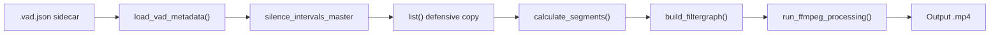

# Research Report: Parallel Folder Processing

**Generated**: 2026-02-22
**Research Query**: "Making it so the script can process videos in parallel, to really soak the GPU"
**Mode**: Pre-Plan
**Location**: docs/plans/008-parallel-folder-processing/research-dossier.md
**FlowSpace**: Not Available
**Findings**: 18

## Executive Summary

### What It Does
VideoSpeeder's folder mode processes multiple video angles sequentially — loading a shared VAD sidecar, then encoding one video at a time via FFmpeg with NVENC GPU encoding. Adding `--parallel N` would run N simultaneous FFmpeg encodes to fully utilize the GPU.

### Business Purpose
When processing 4+ camera angles from the same recording session, sequential encoding wastes GPU capacity. The GPU is idle between compute bursts. Parallel encoding can cut total wall-clock time significantly, especially for multi-angle workflows where all videos share the same VAD timing.

### Key Insights
1. **The current code is ~90% ready for parallel** — sidecar loading, defensive copy, unique temp files are already safe. Only the `setattr` hack on `run_ffmpeg_processing` needs fixing.
2. **NVENC supports 12 concurrent sessions** on current consumer drivers (591.44+), but 2 parallel sessions is the sweet spot for throughput/efficiency (90-95% per-session efficiency).
3. **Only 2 of 4 test clips exist** — need to cut angle1 and angle2 from full-length sources before benchmarking.

### Quick Stats
- **Components**: 1 file (`videospeeder.py`), ~1600 lines
- **Dependencies**: FFmpeg (NVENC), Python stdlib (`concurrent.futures`, `tempfile`)
- **Test Coverage**: None (manual testing only)
- **Complexity**: Medium — straightforward parallelism with GPU session limits
- **Prior Learnings**: 0 (no prior plan discoveries found)

---

## How It Currently Works

### Entry Points

| Entry Point | Type | Location | Purpose |
|-------------|------|----------|---------|
| `main()` | CLI | videospeeder.py:1130 | Argparse entry point |
| Folder mode branch | Code path | videospeeder.py:1255 | Triggered when `args.folder` is set |

### Core Execution Flow (Folder Mode)

1. **Validate args** (lines 1144-1157): Check folder exists, output specified, no conflicts
2. **Resolve sidecar** (lines 1337-1341): From `--vad-json`, `--vad-master`, or auto-discover
3. **Load sidecar once** (line 1344): `silence_intervals_master, analyzed_duration = load_vad_metadata(sidecar_path)`
4. **Discover videos** (line 1350): Scan folder for video extensions
5. **Sequential loop** (lines 1368-1431):
   - For each video: skip if output exists, get duration, defensive copy silence intervals, truncate if needed, build filtergraph, call `run_ffmpeg_processing()`
6. **Report summary** (lines 1434-1442): Success/fail/skip counts

### Data Flow


Each video gets its own copy of the silence intervals (step D), its own segments, filtergraph, and FFmpeg process. **This is embarrassingly parallel** — no data dependencies between videos.

---

## Architecture & Design

### Thread Safety Analysis

| Component | Thread-Safe? | Issue | Fix |
|-----------|-------------|-------|-----|
| `silence_intervals_master` | Yes | Loaded once, never mutated; `list()` copy per video | None needed |
| `tempfile.NamedTemporaryFile` | Yes | Each call produces unique path | None needed |
| `run_ffmpeg_processing.use_gpu_decode` | **NO** | `setattr` on function object — shared across threads | Pass as parameter |
| `run_ffmpeg_processing.progress_segments` | **NO** | `setattr` on function object — shared across threads | Pass as parameter |
| `tqdm` progress bars | **NO** | Multiple bars interleave on stdout | Use file-level progress or `position=i` |
| `success_count`, `fail_count` etc. | N/A | Currently local to `main()` loop | Collect from futures |

### Required Refactoring

**Minimal change**: Convert the 2 `setattr`/`getattr` calls to explicit function parameters:

```python
# BEFORE (not thread-safe):
setattr(run_ffmpeg_processing, "use_gpu_decode", False)
setattr(run_ffmpeg_processing, "progress_segments", segments)
run_ffmpeg_processing(input_file, output_path, filtergraph, ...)

# AFTER (thread-safe):
run_ffmpeg_processing(input_file, output_path, filtergraph, ...,
                      use_gpu_decode=False, progress_segments=segments)
```

---

## NVENC Parallel Session Limits

### Current Driver Limits (Consumer GeForce GPUs)

| Driver Era | Max Concurrent NVENC Sessions |
|-----------|-------------------------------|
| Pre-2023 | 3 |
| March 2023 | 5 |
| January 2024 (551.23+) | 8 |
| December 2025 (591.44+) | **12** |

These limits are **per-system** (all consumer GPUs combined). Professional (Quadro/RTX Pro) GPUs have no artificial limit.

### Performance Scaling

| Parallel Sessions | Per-Session Efficiency | Total Throughput vs Sequential |
|---|---|---|
| 1 | 100% | 1.0x |
| 2 | 90-95% | ~1.8-1.9x |
| 4 | 60-80% | ~2.4-3.2x |
| 8 | 50-60% | ~4.0-4.8x |

**Recommendation**: Default to `--parallel 2` for GPU mode as the sweet spot. Allow up to 8 with warning above 4.

### What Happens When Limit Exceeded
FFmpeg **fails immediately** with `NV_ENC_ERR_OUT_OF_MEMORY` (misleading name — it's the session limit, not actual OOM). No queuing, no retry. The encode operation fails entirely.

### VRAM Usage
~130 MB per NVENC session at 1080p. Even 12 sessions only use ~1.5 GB — well within a typical 8-12 GB consumer GPU. VRAM is not the bottleneck.

---

## Implementation Approach

### CLI Design
```python
parser.add_argument(
    "--parallel", type=int, default=1, metavar="N",
    help="Process N videos simultaneously in folder mode (default: 1). "
         "With --gpu, each video uses one NVENC session."
)
```

### Executor Choice
**`ThreadPoolExecutor`** — Python's GIL is not a concern because the actual work is done by FFmpeg child processes (external to Python). Threads are lighter than processes and sufficient for managing subprocess I/O.

### Progress Display Options

For parallel mode, per-frame tqdm bars would collide. Options:
1. **File-level progress** (recommended): Single bar showing "Files: 2/4 complete"
2. **Stacked bars**: `tqdm(position=i)` per worker — works but cluttered
3. **Suppress progress**: Use `--quiet` in parallel mode

### Error Handling
Use `concurrent.futures.as_completed()` with try/except on `future.result()`. Collect results, report summary at end — same pattern as current sequential mode but with futures.

### Skeleton

```python
from concurrent.futures import ThreadPoolExecutor, as_completed

def process_single_video(video_path, output_dir, silence_intervals_master,
                         analyzed_duration, args, png_path):
    """Thread-safe: no shared mutable state."""
    video_name = os.path.basename(video_path)
    output_path = os.path.join(output_dir, video_name)

    if os.path.isfile(output_path) and not args.overwrite:
        return {"status": "skipped", "file": video_name}

    try:
        # ... per-video logic (duration, intervals copy, segments, filtergraph) ...
        run_ffmpeg_processing(video_path, output_path, filtergraph, video_duration,
                              codec_name, use_gpu=args.gpu,
                              use_gpu_decode=False, progress_segments=segments)
        return {"status": "success", "file": video_name}
    except Exception as e:
        return {"status": "error", "file": video_name, "error": str(e)}

# In folder mode:
with ThreadPoolExecutor(max_workers=args.parallel) as executor:
    futures = {executor.submit(process_single_video, ...): vp for vp in videos}
    for future in as_completed(futures):
        result = future.result()
        # update counters
```

---

## Test Infrastructure

### Current Test Files

| File | Location | Duration | Status |
|------|----------|----------|--------|
| `angle1.mp4` | `scratch/real-test/` | 5:00 | **MISSING** — need to cut from `~/VideoMedia/SoloXC/Angle 1.mp4` |
| `angle2.mp4` | `scratch/real-test/` | 5:00 | **MISSING** — need to cut from `~/VideoMedia/SoloXC/Angle 2.mp4` |
| `angle3.mp4` | `scratch/real-test/` | 5:00 | Present (300.07s) |
| `angle4.mp4` | `scratch/real-test/` | 5:00 | Present (300.07s) |

### Benchmark Plan
1. Cut 5-min clips for angle1 and angle2
2. Generate shared VAD sidecar (detect on angle1)
3. Process all 4 with `--parallel 1` — baseline
4. Process all 4 with `--parallel 2` — sweet spot test
5. Process all 4 with `--parallel 4` — max parallelism test
6. Compare: total wall-clock time, per-file duration match, GPU utilization

---

## Modification Considerations

### Safe to Modify
- **`parse_args()`** — add `--parallel` argument, low risk
- **Folder mode loop** — replace sequential `for` with `ThreadPoolExecutor`
- **Summary reporting** — collect results from futures instead of incrementing counters

### Modify with Caution
- **`run_ffmpeg_processing()`** — must eliminate `setattr`/`getattr` pattern before parallelizing. Need to add `use_gpu_decode` and `progress_segments` as explicit parameters, and update all call sites.
- **tqdm progress bars** — parallel mode needs different progress display strategy

### Extension Points
- The `process_single_video()` extraction is natural — the current loop body is already self-contained per-video
- `ThreadPoolExecutor` can be `ProcessPoolExecutor` if CPU encoding parallelism is needed later

---

## External Research Opportunities

No external research gaps identified. The NVENC session limits and Python parallelism patterns are well-documented and sufficient for this feature.

---

## Recommendations

### Implementation Priority
1. **Refactor `run_ffmpeg_processing`** to accept `use_gpu_decode` and `progress_segments` as parameters (eliminate `setattr` hack)
2. **Extract `process_single_video()`** function from the folder mode loop
3. **Add `--parallel N` argument** with validation (warn if N > 4 with --gpu)
4. **Wrap in `ThreadPoolExecutor`** with file-level progress
5. **Cut missing test clips** and benchmark at 1, 2, 4 parallel

### Default Values
- `--parallel 1` (default — backward compatible)
- Recommended: `--parallel 2` with `--gpu` for most workflows
- Safe maximum: `--parallel 4` with `--gpu` on consumer GPUs
- CPU mode: no practical limit from NVENC, but `libx265` uses many threads per instance

---

**Research Complete**: 2026-02-22
**Report Location**: docs/plans/008-parallel-folder-processing/research-dossier.md
