# Phase 0: Baseline Validation - Tasks & Alignment Brief

**Phase**: Phase 0: Baseline Validation
**Slug**: `phase-0-baseline-validation`
**Plan**: [mac-gpu-acceleration-plan.md](/Users/jordanknight/github/videospeeder/docs/plans/5-mac-gpu-acceleration/mac-gpu-acceleration-plan.md#phase-0-baseline-validation)
**Spec**: [mac-gpu-acceleration-spec.md](/Users/jordanknight/github/videospeeder/docs/plans/5-mac-gpu-acceleration/mac-gpu-acceleration-spec.md)
**Created**: 2025-11-10
**Status**: READY

---

## Tasks

| Status | ID | Task | CS | Type | Dependencies | Absolute Path(s) | Validation | Subtasks | Notes |
|--------|-----|------|----|----|--------------|------------------|------------|----------|-------|
| [ ] | T001 | Verify FFmpeg installation | 1 | Setup | – | N/A (command-line validation) | `ffmpeg -version` shows version 4.x+ with build information; command exits with code 0 | – | [P] Can run independently; Supports plan task 0.1 |
| [ ] | T002 | Check VideoToolbox encoder availability in FFmpeg | 1 | Setup | T001 | N/A (command-line validation) | `ffmpeg -encoders \| grep videotoolbox` returns h264_videotoolbox and hevc_videotoolbox entries; both present confirms Discovery 08 requirement | – | Serial after T001 (verifies FFmpeg functional); Per Discovery 08 (FFmpeg Availability Detection); Supports plan task 0.2 |
| [ ] | T003 | List available test videos in scratch folder | 1 | Setup | – | /Users/jordanknight/github/videospeeder/scratch/ | `ls -lh scratch/*.mp4` or `ls -lh scratch/*.mov` shows at least one video file; file size > 0 bytes | – | [P] Can run independently; Identifies test asset for T004-T007; Supports plan task 0.3 |
| [ ] | T004 | Test current VideoSpeeder CPU encoding (baseline) | 2 | Test | T003 | /Users/jordanknight/github/videospeeder/videospeeder_project/videospeeder.py, /Users/jordanknight/github/videospeeder/scratch/ | Command completes with exit code 0; output file `scratch/test-baseline-output.mp4` exists; no Python exceptions in stderr | – | Serial after T003 (needs test video); Validates existing functionality before modifications; Supports plan task 0.4 |
| [ ] | T005 | Verify CPU-encoded output video playable | 1 | Test | T004 | /Users/jordanknight/github/videospeeder/scratch/test-baseline-output.mp4 | Video opens in QuickTime or VLC without errors; video plays from start to finish; audio and video streams both present and synchronized | – | Serial after T004 (validates output); Supports plan task 0.5 |
| [ ] | T006 | Test VideoToolbox encoding directly via FFmpeg CLI | 2 | Test | T003 | /Users/jordanknight/github/videospeeder/scratch/ | FFmpeg command with h264_videotoolbox encoder completes successfully; output file `scratch/test-vt-direct.mp4` created; FFmpeg stderr shows VideoToolbox session initialized | – | Serial after T003 (needs test video); Proves VideoToolbox functional before integration; Uses bitrate control (-b:v 10M) not CRF; Supports plan task 0.6 |
| [ ] | T007 | Verify VideoToolbox-encoded output video playable | 1 | Test | T006 | /Users/jordanknight/github/videospeeder/scratch/test-vt-direct.mp4 | Video opens in QuickTime without errors; video plays completely; QuickTime confirms H.264 codec in inspector | – | Serial after T006 (validates VT output); Confirms VideoToolbox produces valid H.264; Supports plan task 0.7 |
| [ ] | T008 | Analyze FFmpeg output for pixel format warnings | 1 | Test | T006 | /Users/jordanknight/github/videospeeder/scratch/ | FFmpeg stderr from T006 reviewed for pixel format messages; any "Incompatible pixel format" or "auto-selecting format" warnings documented in execution log | – | Serial after T006 (analyzes same command output); Previews Discovery 05 (Pixel Format Mismatch); Supports plan task 0.8 |
| [ ] | T009 | Document baseline system environment | 1 | Doc | – | /Users/jordanknight/github/videospeeder/docs/plans/5-mac-gpu-acceleration/tasks/phase-0-baseline-validation/execution.log.md | Execution log contains: macOS version, chip model (M1/M2/M3 or Intel), FFmpeg version and build date, Python version | – | [P] Can run independently; Creates environment record for reproducibility; Supports plan task 0.9 |
| [ ] | T010 | Clean up test output files | 1 | Setup | T005, T007 | /Users/jordanknight/github/videospeeder/scratch/ | Files `test-baseline-output.mp4` and `test-vt-direct.mp4` removed; scratch folder restored to clean state; `ls scratch/*.mp4` shows only original test video | – | Serial after T005, T007 (validates complete); Prevents scratch folder pollution; Supports plan task 0.10 |

**Task Count**: 10 tasks
**Complexity Distribution**: CS-1 (8 tasks), CS-2 (2 tasks)
**Parallelization Opportunities**: T001, T003, T009 can run in parallel initially; remaining tasks are serial validations

---

## Alignment Brief

### Objective

Verify that the current VideoSpeeder implementation and FFmpeg environment are functional before beginning Mac GPU acceleration development. Establish a validated baseline that confirms:
1. Existing CPU encoding works correctly
2. FFmpeg has VideoToolbox support compiled in
3. VideoToolbox encoding produces valid output
4. Development environment is documented

**Success Criteria** (from plan § Phase 0 Acceptance Criteria):
- [ ] All 10 tasks completed successfully
- [ ] FFmpeg with VideoToolbox confirmed available
- [ ] Current VideoSpeeder CPU encoding functional (baseline)
- [ ] Direct VideoToolbox encoding via FFmpeg CLI successful
- [ ] Test video identified and validated
- [ ] System information documented for reference
- [ ] No blocking issues preventing implementation

### Prior Phases Review

**N/A** - This is Phase 0 (pre-implementation validation). No prior implementation phases exist.

### Non-Goals (Scope Boundaries)

❌ **NOT doing in Phase 0**:
- **No code modifications**: This phase is read-only validation; we do not modify videospeeder.py or any source code
- **No automated testing**: All validation is manual command execution; no test framework or scripts created
- **No performance benchmarking**: Observing that encoding works, not measuring speed or comparing performance
- **No integration with VideoSpeeder**: Testing VideoToolbox via raw FFmpeg CLI only; not integrating into videospeeder.py yet
- **No error handling implementation**: If errors occur, we document them and may install missing dependencies, but we don't implement error recovery code
- **No quality assessment**: Verifying videos play correctly, not evaluating visual quality or file size optimization
- **No GPU detection code**: Not implementing hardware detection logic (Phase 1); only observing system capabilities
- **No multi-resolution testing**: Using a single test video; comprehensive testing deferred to Phase 8

### Critical Findings Affecting This Phase

**Discovery 08: FFmpeg Availability Detection** (Medium Impact)
- **What it constrains**: Not all FFmpeg builds include VideoToolbox support (conda builds often exclude it)
- **How it affects Phase 0**: Task T002 explicitly validates VideoToolbox encoders present before proceeding
- **Tasks addressing it**: T002 checks for both h264_videotoolbox and hevc_videotoolbox encoders
- **Mitigation**: If VideoToolbox missing, execution log will recommend `brew install ffmpeg` before Phase 1

**Discovery 05: Pixel Format Mismatch from Filters** (High Impact - Preview)
- **What it previews**: CPU filters (overlay with PNG alpha) may output incompatible pixel formats for VideoToolbox
- **How it affects Phase 0**: Task T008 analyzes FFmpeg stderr for pixel format warnings during direct VT encoding
- **Tasks addressing it**: T008 documents any "Incompatible pixel format" or "auto-selecting format" warnings
- **Future relevance**: Phase 5 will need to force `-pix_fmt yuv420p` if warnings appear in T008

**No Direct Impact from Other Discoveries**:
- Discovery 01 (CRF Incompatibility) - Affects Phase 5 implementation, not Phase 0 validation
- Discovery 02 (Silent Software Fallback) - Affects Phase 5/6 error handling, not baseline validation
- Discovery 03 (Rosetta Detection) - Affects Phase 1 hardware detection, not FFmpeg validation
- Discovery 04 (AV1 Unavailable) - Affects Phase 2/6 codec mapping, not H.264 baseline test

### ADR Decision Constraints

**N/A** - No ADRs exist for this project. ADR directory `/Users/jordanknight/github/videospeeder/docs/adr/` does not exist.

### Invariants & Guardrails

**Environment Requirements**:
- macOS 11+ (Big Sur or later) for stable VideoToolbox API
- FFmpeg 4.x+ with VideoToolbox support (Homebrew build standard)
- Python 3.6+ (3.9+ recommended)
- At least one test video file in scratch folder (any codec, any resolution)

**Validation Guardrails**:
- All commands must complete with exit code 0 (success)
- All output videos must be playable in QuickTime (macOS native player)
- FFmpeg VideoToolbox encoders must be present (both H.264 and HEVC)
- No modifications to source code or configuration files

**Failure Handling**:
- If FFmpeg missing: Install via `brew install ffmpeg`
- If VideoToolbox encoders absent: Reinstall FFmpeg with full features via Homebrew
- If VideoSpeeder baseline broken: Document error, fix issue before proceeding to Phase 1
- If no test video available: Use any short video from user's filesystem or download sample

### Inputs to Read

**Source Code** (read-only, no modifications):
- `/Users/jordanknight/github/videospeeder/videospeeder_project/videospeeder.py` - Current implementation to validate

**Test Assets**:
- `/Users/jordanknight/github/videospeeder/scratch/*.mp4` or `*.mov` - At least one test video
- If missing: User should provide any video file for testing

**System Resources**:
- FFmpeg installation (system-wide or Homebrew)
- QuickTime Player (macOS built-in)
- Python 3 interpreter

### Visual Alignment: System Flow

```mermaid
flowchart TD
    Start([Phase 0 Start]) --> T001[T001: Verify FFmpeg]
    Start --> T003[T003: List Test Videos]
    Start --> T009[T009: Document Environment]

    T001 --> T002[T002: Check VideoToolbox Encoders]
    T002 --> |VT Available| T006[T006: Test VT Direct Encoding]
    T002 --> |VT Missing| Fail1[❌ Install Homebrew FFmpeg]

    T003 --> |Video Found| T004[T004: Test VideoSpeeder CPU]
    T003 --> |No Video| Fail2[❌ Provide Test Video]

    T004 --> T005[T005: Verify CPU Output Playable]
    T006 --> T007[T007: Verify VT Output Playable]
    T006 --> T008[T008: Check Pixel Format Warnings]

    T005 --> Ready{All Tests Pass?}
    T007 --> Ready
    T008 --> Ready
    T009 --> Ready

    Ready --> |Yes| T010[T010: Clean Up Test Files]
    Ready --> |No| Fail3[❌ Document Issues, Fix Before Phase 1]

    T010 --> Success([✅ Phase 0 Complete - Ready for Phase 1])

    Fail1 --> Stop([🛑 Block Phase 1])
    Fail2 --> Stop
    Fail3 --> Stop

    style T001 fill:#e1f5ff
    style T003 fill:#e1f5ff
    style T009 fill:#e1f5ff
    style T002 fill:#fff4e1
    style T006 fill:#ffe1e1
    style T004 fill:#ffe1e1
    style Success fill:#d4edda
    style Stop fill:#f8d7da
```



### Visual Alignment: Execution Sequence


### Test Plan

**Testing Approach**: Manual Only (per spec § Testing Strategy)

This phase uses **manual command-line testing only**. No automated test framework, no test scripts, no assertions in code. All validation is observational:

1. **FFmpeg Validation Tests**:
   - **T001**: Command execution test - `ffmpeg -version` returns successfully
   - **T002**: Feature availability test - VideoToolbox encoders present in build
   - **Purpose**: Confirm FFmpeg installation and VideoToolbox support before proceeding

2. **VideoSpeeder Baseline Tests**:
   - **T004**: Integration test - Current VideoSpeeder can process a video end-to-end
   - **T005**: Output validation test - Encoded video is playable and correct
   - **Purpose**: Establish that existing functionality works (regression baseline)

3. **VideoToolbox Direct Tests**:
   - **T006**: Encoder functional test - VideoToolbox can encode H.264 via FFmpeg CLI
   - **T007**: Output validation test - VideoToolbox output is playable
   - **T008**: Diagnostic test - Identify any pixel format compatibility issues
   - **Purpose**: Prove VideoToolbox works independently before integration

4. **Environment Documentation**:
   - **T009**: System information capture - Record macOS, chip, FFmpeg, Python versions
   - **Purpose**: Create reproducible environment record for troubleshooting

5. **Cleanup**:
   - **T010**: File management - Remove test artifacts
   - **Purpose**: Restore scratch folder to clean state

**No Fixtures Required**: Using real video files from scratch folder
**No Mocks Required**: Testing real FFmpeg and VideoToolbox, not mocking system APIs
**No Assertions in Code**: All validation is manual observation and documentation

**Pass Criteria**:
- All commands complete with exit code 0
- All videos play in QuickTime without errors
- FFmpeg VideoToolbox encoders confirmed present
- Environment information documented in execution log

### Step-by-Step Implementation Outline

**Phase 0 has no implementation** - only validation. Execution sequence:

1. **Setup & Environment Check** (T001, T003, T009 - Can run in parallel):
   - T001: Run `ffmpeg -version`, confirm version 4.x+
   - T003: Run `ls scratch/*.mp4`, identify test video filename
   - T009: Run `sw_vers`, `sysctl`, `ffmpeg -version`, `python3 --version`, document in log

2. **VideoToolbox Availability** (T002 - Serial after T001):
   - T002: Run `ffmpeg -encoders | grep videotoolbox`, confirm h264_videotoolbox and hevc_videotoolbox present
   - If missing: Document error, recommend `brew install ffmpeg`, block Phase 1

3. **Baseline CPU Encoding** (T004, T005 - Serial after T003):
   - T004: Run `python3 videospeeder.py -i scratch/<video> -o scratch/test-baseline-output.mp4`
   - T005: Run `open scratch/test-baseline-output.mp4`, verify playback

4. **VideoToolbox Direct Test** (T006, T007, T008 - Serial after T003 and T002):
   - T006: Run `ffmpeg -i scratch/<video> -c:v h264_videotoolbox -b:v 10M -pix_fmt yuv420p -c:a aac scratch/test-vt-direct.mp4`
   - T007: Run `open scratch/test-vt-direct.mp4`, verify playback
   - T008: Review T006 FFmpeg stderr, document any pixel format warnings

5. **Cleanup** (T010 - Serial after T005, T007):
   - T010: Run `rm scratch/test-baseline-output.mp4 scratch/test-vt-direct.mp4`

**Total Execution**: ~5-10 command executions (CS complexity aligns with trivial/small designation)

### Commands to Run

All commands are copy-paste ready. Replace `<input-video>` with actual filename from T003 output.

**T001: Verify FFmpeg Installation**
```bash
ffmpeg -version
# Expected: FFmpeg version 4.x.x, build info, configuration flags
```

**T002: Check VideoToolbox Encoders**
```bash
ffmpeg -encoders | grep videotoolbox
# Expected output:
#  V..... h264_videotoolbox    VideoToolbox H.264 Encoder (codec h264)
#  V..... hevc_videotoolbox    VideoToolbox H.265 Encoder (codec hevc)
```

**T003: List Test Videos**
```bash
ls -lh /Users/jordanknight/github/videospeeder/scratch/*.mp4
# Or:
ls -lh /Users/jordanknight/github/videospeeder/scratch/*.mov
# Expected: At least one video file listed with size > 0
```

**T004: Test VideoSpeeder CPU Baseline**
```bash
cd /Users/jordanknight/github/videospeeder
python3 videospeeder_project/videospeeder.py \
  -i scratch/<input-video>.mp4 \
  -o scratch/test-baseline-output.mp4
# Expected: Command completes, progress bar shows, exit code 0
```

**T005: Verify CPU Output Playable**
```bash
# macOS QuickTime:
open /Users/jordanknight/github/videospeeder/scratch/test-baseline-output.mp4

# Or VLC (if installed):
vlc /Users/jordanknight/github/videospeeder/scratch/test-baseline-output.mp4

# Expected: Video opens, plays start to finish, audio present
```

**T006: Test VideoToolbox Direct**
```bash
cd /Users/jordanknight/github/videospeeder
ffmpeg -i scratch/<input-video>.mp4 \
  -c:v h264_videotoolbox \
  -b:v 10M \
  -pix_fmt yuv420p \
  -c:a aac \
  scratch/test-vt-direct.mp4
# Expected: FFmpeg completes, output file created, exit code 0
# Watch stderr for "VideoToolbox" mentions
```

**T007: Verify VideoToolbox Output Playable**
```bash
open /Users/jordanknight/github/videospeeder/scratch/test-vt-direct.mp4
# Expected: Video plays correctly in QuickTime
# Cmd+I in QuickTime → Verify codec is H.264
```

**T008: Check Pixel Format Warnings**
```bash
# Re-run T006 command and review stderr output
ffmpeg -i scratch/<input-video>.mp4 \
  -c:v h264_videotoolbox \
  -b:v 10M \
  -pix_fmt yuv420p \
  -c:a aac \
  scratch/test-vt-direct.mp4 2>&1 | grep -i "pixel\|format"
# Look for: "Incompatible pixel format", "auto-selecting format"
# Document any warnings in execution log
```

**T009: Document System Environment**
```bash
# macOS version
sw_vers

# Chip model (Apple Silicon)
sysctl -n machdep.cpu.brand_string
# Or for marketing name:
system_profiler SPHardwareDataType | grep "Chip:"

# FFmpeg version
ffmpeg -version | head -1

# Python version
python3 --version

# Document all output in execution log
```

**T010: Clean Up Test Files**
```bash
cd /Users/jordanknight/github/videospeeder
rm scratch/test-baseline-output.mp4 scratch/test-vt-direct.mp4
# Verify clean:
ls scratch/*.mp4
# Expected: Only original test video, no test-* files
```

### Risks & Unknowns

| Risk | Severity | Likelihood | Mitigation |
|------|----------|------------|------------|
| FFmpeg not installed | 🔴 Critical | Low | Document installation command: `brew install ffmpeg` |
| FFmpeg missing VideoToolbox | 🔴 Critical | Medium | Recommend Homebrew FFmpeg (includes VT by default); conda builds often exclude it |
| No test video in scratch folder | 🟡 Medium | Low | User provides any video file; can use sample from ~/Movies or download test clip |
| Current VideoSpeeder broken | 🔴 Critical | Low | Document error in execution log; fix baseline before Phase 1; may indicate dependency issues |
| VideoToolbox hardware busy | 🟡 Medium | Low | Close other video apps (camera, screen recording); retry command |
| Pixel format warnings | 🟢 Low | Medium | Expected for some source videos; document findings for Phase 5 reference |
| Intel Mac (no Apple Silicon) | 🟡 Medium | Medium | Phase 0 still validates FFmpeg/VT availability; full GPU support tested in Phase 8 |
| Python version incompatibility | 🟡 Medium | Low | VideoSpeeder requires Python 3.6+; document version in T009 |

**Unknowns**:
- Source video codec/format in scratch folder (unknown until T003)
- Whether test video will trigger pixel format warnings (discovered in T008)
- Exact FFmpeg build configuration (may vary if not Homebrew install)

**Mitigation Strategy**:
- All risks documented in execution log with resolution steps
- Critical blockers (FFmpeg missing, VT unavailable) prevent Phase 1 start
- Medium risks documented but don't block (e.g., pixel warnings inform Phase 5)

### Ready Check

Verify all prerequisites before executing Phase 0:

**Environment Prerequisites**:
- [ ] macOS system (Phase 0 can run on Intel or Apple Silicon)
- [ ] Terminal access with command-line execution permissions
- [ ] Python 3 installed and accessible via `python3` command
- [ ] At least one video file available (in scratch folder or elsewhere)

**Tool Prerequisites**:
- [ ] FFmpeg installed (will verify in T001)
- [ ] QuickTime Player available (macOS built-in)
- [ ] Access to install Homebrew packages if FFmpeg missing

**Documentation Ready**:
- [ ] Execution log path defined: `/Users/jordanknight/github/videospeeder/docs/plans/5-mac-gpu-acceleration/tasks/phase-0-baseline-validation/execution.log.md`
- [ ] Ready to document all command outputs and observations

**Scope Understanding**:
- [ ] Phase 0 is read-only validation (no code changes)
- [ ] All tasks are manual command execution
- [ ] Failures in Phase 0 block Phase 1 (must fix before proceeding)
- [ ] Success in Phase 0 confirms environment ready for implementation

**Critical Findings Awareness**:
- [ ] Discovery 08 (FFmpeg Availability) will be validated in T002
- [ ] Discovery 05 (Pixel Format) will be previewed in T008
- [ ] Other discoveries affect later phases, not Phase 0

**GO / NO-GO Decision**:
- [ ] **GO**: All ready checks passed, proceed with T001
- [ ] **NO-GO**: Missing prerequisites, install/configure before starting

---

## Phase Footnote Stubs

**NOTE**: This section will be populated during implementation by `/plan-6-implement-phase`.

Footnotes track file/function changes across tasks. Since Phase 0 has no code modifications, this section will remain empty. Future phases will use footnotes to reference specific code changes.

**Format** (for reference):
```markdown
[^N]: Task T-ID - Description
  - `flowspace-node-id` (e.g., `function:path/file.py:function_name`)
  - `flowspace-node-id`
```

**Initial State**: No footnotes (Phase 0 is validation only, no code changes)

---

## Evidence Artifacts

### Execution Log

**Location**: `/Users/jordanknight/github/videospeeder/docs/plans/5-mac-gpu-acceleration/tasks/phase-0-baseline-validation/execution.log.md`

**Content Structure**:
```markdown
# Phase 0: Baseline Validation - Execution Log

**Phase**: Phase 0: Baseline Validation
**Executed**: [Date]
**Executor**: [User/Agent]
**Duration**: [Start] - [End]
**Status**: [IN PROGRESS | COMPLETE | BLOCKED]

## Task Execution

### T001: Verify FFmpeg Installation
**Status**: [ ] Complete
**Command**: `ffmpeg -version`
**Output**: [Paste ffmpeg -version output]
**Result**: ✓ PASS / ✗ FAIL
**Notes**: [Any observations]

### T002: Check VideoToolbox Encoders
**Status**: [ ] Complete
**Command**: `ffmpeg -encoders | grep videotoolbox`
**Output**: [Paste encoder list]
**Result**: ✓ PASS / ✗ FAIL
**Discovery 08 Confirmed**: Yes/No
**Notes**: [Observations]

[... Continue for all tasks T003-T010 ...]

## Environment Documentation (T009)

**macOS Version**:
```
[Paste sw_vers output]
```

**Chip Model**:
```
[Paste sysctl or system_profiler output]
```

**FFmpeg Version**:
```
[Paste ffmpeg -version | head -1]
```

**Python Version**:
```
[Paste python3 --version]
```

## Pixel Format Analysis (T008)

**FFmpeg stderr from T006**:
```
[Paste relevant stderr lines]
```

**Warnings Found**: Yes/No
**Details**: [Description of any pixel format warnings]
**Implication for Phase 5**: [Note if `-pix_fmt yuv420p` forcing needed]

## Summary

**Total Tasks**: 10
**Completed**: X/10
**Failed**: X/10
**Blocked**: X/10

**Phase 0 Outcome**: ✅ READY FOR PHASE 1 / ⛔ BLOCKED (fix issues before Phase 1)

**Issues Encountered**: [List any problems]
**Resolutions**: [How issues were resolved]
**Blockers for Phase 1**: [Any unresolved critical issues]
```

### Supporting Files

**No additional files expected** - Phase 0 is command-line validation only.

Temporary test outputs created and removed:
- `scratch/test-baseline-output.mp4` (created in T004, removed in T010)
- `scratch/test-vt-direct.mp4` (created in T006, removed in T010)

---

## Directory Layout

```
/Users/jordanknight/github/videospeeder/docs/plans/5-mac-gpu-acceleration/
├── mac-gpu-acceleration-plan.md
├── mac-gpu-acceleration-spec.md
├── research.md
└── tasks/
    └── phase-0-baseline-validation/
        ├── tasks.md (this file)
        └── execution.log.md (created by /plan-6-implement-phase)
```

**Next Phase**: After Phase 0 completes successfully, proceed to Phase 1: Hardware Detection Infrastructure

---

**Status**: ⏸️ **AWAITING GO/NO-GO** - Ready for execution pending user confirmation
